# Дипломная работа
#### Выполнил - Каплин Владимир

Дипломный практикум в YandexCloud

Цели:

Зарегистрировать доменное имя (любое на ваш выбор в любой доменной зоне).
Подготовить инфраструктуру с помощью Terraform на базе облачного провайдера YandexCloud.
Настроить внешний Reverse Proxy на основе Nginx и LetsEncrypt.
Настроить кластер MySQL.
Установить WordPress.
Развернуть Gitlab CE и Gitlab Runner.
Настроить CI/CD для автоматического развёртывания приложения.
Настроить мониторинг инфраструктуры с помощью стека: Prometheus, Alert Manager и Grafana.
Этапы выполнения:

1. Регистрация доменного имени

Подойдет любое доменное имя на ваш выбор в любой доменной зоне.
ПРИМЕЧАНИЕ: Далее в качестве примера используется домен you.domain замените его вашим доменом.
Рекомендуемые регистраторы:

• nic.ru
• reg.ru

Цель:

Получить возможность выписывать TLS сертификаты для веб-сервера.
Ожидаемые результаты:

У вас есть доступ к личному кабинету на сайте регистратора.
Вы зарезистрировали домен и можете им управлять (редактировать dns записи в рамках этого домена).

###Решение:

- Зарегестрирован новый домен kapelman.online


2. Создание инфраструктуры

Для начала необходимо подготовить инфраструктуру в YC при помощи Terraform.

Особенности выполнения:

Бюджет купона ограничен, что следует иметь в виду при проектировании инфраструктуры и использовании ресурсов;
Следует использовать последнюю стабильную версию Terraform.
Предварительная подготовка:

Создайте сервисный аккаунт, который будет в дальнейшем использоваться Terraform для работы с инфраструктурой с необходимыми и достаточными правами. Не стоит использовать права суперпользователя
Подготовьте backend для Terraform:
а. Рекомендуемый вариант: Terraform Cloud
б. Альтернативный вариант: S3 bucket в созданном YC аккаунте.

Настройте workspaces
а. Рекомендуемый вариант: создайте два workspace: stage и prod. В случае выбора этого варианта все последующие шаги должны учитывать факт существования нескольких workspace.
б. Альтернативный вариант: используйте один workspace, назвав его stage. Пожалуйста, не используйте workspace, создаваемый Terraform-ом по-умолчанию (default).

Создайте VPC с подсетями в разных зонах доступности.
Убедитесь, что теперь вы можете выполнить команды terraform destroy и terraform apply без дополнительных ручных действий.
В случае использования Terraform Cloud в качестве backend убедитесь, что применение изменений успешно проходит, используя web-интерфейс Terraform cloud.
Цель:

Повсеместно применять IaaC подход при организации (эксплуатации) инфраструктуры.
Иметь возможность быстро создавать (а также удалять) виртуальные машины и сети. С целью экономии денег на вашем аккаунте в YandexCloud.
Ожидаемые результаты:

Terraform сконфигурирован и создание инфраструктуры посредством Terraform возможно без дополнительных ручных действий.
Полученная конфигурация инфраструктуры является предварительной, поэтому в ходе дальнейшего выполнения задания возможны изменения.

### Решение:

- Создадим отдельного сервисного пользователя:
```
vagrant@vagrant:~/diplom/terraform$ yc iam service-account list
+----------------------+------------------+
|          ID          |       NAME       |
+----------------------+------------------+
| aje2e5p4jmfabmosensm | my-robot2        |
| ajeandk8p5i8tahq66g9 | service-kapelman |
+----------------------+------------------+

vagrant@vagrant:~/diplom/terraform$ yc iam service-account create --name service-diplom
id: ajeprno2te7jkudeojfj
folder_id: b1g5fh031uiok7frafp8
created_at: "2022-10-16T12:48:41.723194087Z"
name: service-diplom
```
- назначим права
```
vagrant@vagrant:~/diplom/terraform$ yc iam service-account list
+----------------------+------------------+
|          ID          |       NAME       |
+----------------------+------------------+
| aje2e5p4jmfabmosensm | my-robot2        |
| ajeandk8p5i8tahq66g9 | service-kapelman |
| ajeprno2te7jkudeojfj | service-diplom   |
+----------------------+------------------+
```
- на создание инстанса
```
vagrant@vagrant:~/diplom/terraform$ yc resource-manager folder add-access-binding b1g5fh031uiok7frafp8 --role compute.admin --subject serviceAccount:ajeprno2te7jkudeojfj
done (1s)
```
- на создание storage
```
vagrant@vagrant:~/diplom/terraform$ yc resource-manager folder add-access-binding b1g5fh031uiok7frafp8 --role storage.editor --subject serviceAccount:ajeprno2te7jkudeojfj
done (1s)
```

- Дополнительные настройки: 
```
vagrant@vagrant:~/diplom/terraform$ nano ~/.terraformrc

provider_installation {
  network_mirror {
    url = "https://terraform-mirror.yandexcloud.net/"
    include = ["registry.terraform.io/*/*"]
  }
  direct {
    exclude = ["registry.terraform.io/*/*"]
  }
}
```

- используем image Ubuntu 22.04 от Yandex, ID fd8h059qvtg37ks9ke9o на основании его создадим свой образ с помощью Packer и набором полезных программ.
скрипт создания образа при помощи packer есть в репозитарии.

- создадим новый образ:
```buildoutcfg
vagrant@vagrant:~/diplom/final/packer$ packer build ubuntu.json
Ubuntu 22.04 LTS: output will be in this color.

==> Ubuntu 22.04 LTS: Creating temporary RSA SSH key for instance...
==> Ubuntu 22.04 LTS: Using as source image: fd8kb72eo1r5fs97a1ki (name: "ubuntu-22-04-lts-v20221017", family: "ubuntu-2204-lts")
==> Ubuntu 22.04 LTS: Use provided subnet id e9b4hs6lipbfuvr8oc2s
==> Ubuntu 22.04 LTS: Creating disk...
==> Ubuntu 22.04 LTS: Creating instance...
==> Ubuntu 22.04 LTS: Waiting for instance with id fhm83ht68qdpptv4n2nl to become active...
    Ubuntu 22.04 LTS: Detected instance IP: 51.250.12.188
==> Ubuntu 22.04 LTS: Using SSH communicator to connect: 51.250.12.188
==> Ubuntu 22.04 LTS: Waiting for SSH to become available...
==> Ubuntu 22.04 LTS: Connected to SSH!
==> Ubuntu 22.04 LTS: Provisioning with shell script: /tmp/packer-shell1193752231
==> Ubuntu 22.04 LTS:
==> Ubuntu 22.04 LTS: WARNING: apt does not have a stable CLI interface. Use with caution in scripts.
==> Ubuntu 22.04 LTS:
    Ubuntu 22.04 LTS: Hit:1 http://ru.archive.ubuntu.com/ubuntu jammy InRelease
    Ubuntu 22.04 LTS: Get:2 http://ru.archive.ubuntu.com/ubuntu jammy-updates InRelease [114 kB]
    Ubuntu 22.04 LTS: Get:3 http://ru.archive.ubuntu.com/ubuntu jammy-backports InRelease [99.8 kB]
    Ubuntu 22.04 LTS: Get:4 http://ru.archive.ubuntu.com/ubuntu jammy-security InRelease [110 kB]
    Ubuntu 22.04 LTS: Get:5 http://ru.archive.ubuntu.com/ubuntu jammy-updates/main amd64 Packages [662 kB]
    Ubuntu 22.04 LTS: Get:6 http://ru.archive.ubuntu.com/ubuntu jammy-updates/main Translation-en [152 kB]
    Ubuntu 22.04 LTS: Get:7 http://ru.archive.ubuntu.com/ubuntu jammy-updates/main amd64 c-n-f Metadata [9,404 B]
    Ubuntu 22.04 LTS: Get:8 http://ru.archive.ubuntu.com/ubuntu jammy-updates/restricted amd64 Packages [399 kB]
    Ubuntu 22.04 LTS: Get:9 http://ru.archive.ubuntu.com/ubuntu jammy-updates/restricted Translation-en [61.3 kB]
    Ubuntu 22.04 LTS: Get:10 http://ru.archive.ubuntu.com/ubuntu jammy-updates/restricted amd64 c-n-f Metadata [532 B]
    Ubuntu 22.04 LTS: Get:11 http://ru.archive.ubuntu.com/ubuntu jammy-updates/universe amd64 Packages [435 kB]
    Ubuntu 22.04 LTS: Get:12 http://ru.archive.ubuntu.com/ubuntu jammy-updates/universe Translation-en [110 kB]
    Ubuntu 22.04 LTS: Get:13 http://ru.archive.ubuntu.com/ubuntu jammy-security/main amd64 Packages [435 kB]
    Ubuntu 22.04 LTS: Get:14 http://ru.archive.ubuntu.com/ubuntu jammy-security/main Translation-en [96.5 kB]
    Ubuntu 22.04 LTS: Get:15 http://ru.archive.ubuntu.com/ubuntu jammy-security/restricted amd64 Packages [363 kB]
    Ubuntu 22.04 LTS: Get:16 http://ru.archive.ubuntu.com/ubuntu jammy-security/restricted Translation-en [55.8 kB]
    Ubuntu 22.04 LTS: Get:17 http://ru.archive.ubuntu.com/ubuntu jammy-security/universe amd64 Packages [307 kB]
    Ubuntu 22.04 LTS: Get:18 http://ru.archive.ubuntu.com/ubuntu jammy-security/universe Translation-en [68.7 kB]
    Ubuntu 22.04 LTS: Fetched 3,480 kB in 2s (1,908 kB/s)
    Ubuntu 22.04 LTS: Reading package lists...
    Ubuntu 22.04 LTS: Building dependency tree...
    Ubuntu 22.04 LTS: Reading state information...
    Ubuntu 22.04 LTS: 15 packages can be upgraded. Run 'apt list --upgradable' to see them.
    Ubuntu 22.04 LTS: Reading package lists...
==> Ubuntu 22.04 LTS:
==> Ubuntu 22.04 LTS: WARNING: apt does not have a stable CLI interface. Use with caution in scripts.
    Ubuntu 22.04 LTS: Building dependency tree...
==> Ubuntu 22.04 LTS:
    Ubuntu 22.04 LTS: Reading state information...
    Ubuntu 22.04 LTS: openssh-server is already the newest version (1:8.9p1-3).
    Ubuntu 22.04 LTS: openssh-server set to manually installed.
    Ubuntu 22.04 LTS: 0 upgraded, 0 newly installed, 0 to remove and 15 not upgraded.
==> Ubuntu 22.04 LTS: Stopping instance...
==> Ubuntu 22.04 LTS: Deleting instance...
    Ubuntu 22.04 LTS: Instance has been deleted!
==> Ubuntu 22.04 LTS: Creating image: packer-1666473449
==> Ubuntu 22.04 LTS: Waiting for image to complete...
==> Ubuntu 22.04 LTS: Success image create...
==> Ubuntu 22.04 LTS: Destroying boot disk...
    Ubuntu 22.04 LTS: Disk has been deleted!
Build 'Ubuntu 22.04 LTS' finished after 2 minutes 52 seconds.

==> Wait completed after 2 minutes 52 seconds

==> Builds finished. The artifacts of successful builds are:
--> Ubuntu 22.04 LTS: A disk image was created: packer-1666473449 (id: fd8u71fsujnnh39jhim3) with family name ubuntu-2204-lts
```
- получим статический ключ для сервисного пользователя
```
vagrant@vagrant:~/diplom/terraform$ yc iam access-key create --service-account-name service-diplom
access_key:
  id: ajekdfjc80ct508eehs0
  service_account_id: ajeprno2te7jkudeojfj
  created_at: "2022-10-16T16:39:11.318620253Z"
  key_id: YCAJEjgfJa3kE00LspOTX_wGL
secret: ****************************
```

- создадим новый профиль 
```
vagrant@vagrant:~/.ssh$ yc config profile create 'sa-diplom'
Profile 'sa-diplom' created and activated
```
- создадим workspace stage и prod 
```
vagrant@vagrant:~/diplom/terraform/before-start$ terraform workspace new "stage"
Created and switched to workspace "stage"!
``
You're now on a new, empty workspace. Workspaces isolate their state,
so if you run "terraform plan" Terraform will not see any existing state
for this configuration.
vagrant@vagrant:~/diplom/terraform/before-start$ terraform workspace new "prod"
Created and switched to workspace "prod"!

You're now on a new, empty workspace. Workspaces isolate their state,
so if you run "terraform plan" Terraform will not see any existing state
for this configuration.

vagrant@vagrant:~/diplom/terraform/before-start$ terraform workspace list
  default
* prod
  stage

vagrant@vagrant:~/diplom/terraform/before-start$ terraform workspace select stage
Switched to workspace "stage".
```
- проверим terraform plan
```
vagrant@vagrant:~/diplom/terraform/before-start$ terraform plan

Terraform used the selected providers to generate the following execution plan. Resource actions are indicated with the following symbols:
  + create

Terraform will perform the following actions:

  # yandex_compute_image.image-1 will be created
  + resource "yandex_compute_image" "image-1" {
      + created_at      = (known after apply)
      + folder_id       = (known after apply)
      + id              = (known after apply)
      + min_disk_size   = (known after apply)
      + name            = "kaplin-ubuntu"
      + os_type         = (known after apply)
      + pooled          = (known after apply)
      + product_ids     = (known after apply)
      + size            = (known after apply)
      + source_disk     = (known after apply)
      + source_family   = (known after apply)
      + source_image    = "fd8h059qvtg37ks9ke9o"
      + source_snapshot = (known after apply)
      + source_url      = (known after apply)
      + status          = (known after apply)
    }

  # yandex_compute_instance.node-nginx will be created
  + resource "yandex_compute_instance" "node-nginx" {
      + allow_stopping_for_update = true
      + created_at                = (known after apply)
      + folder_id                 = (known after apply)
      + fqdn                      = (known after apply)
      + hostname                  = "kapelman.site"
      + id                        = (known after apply)
      + name                      = "kapelman.site"
      + network_acceleration_type = "standard"
      + platform_id               = "standard-v1"
      + service_account_id        = (known after apply)
      + status                    = (known after apply)
      + zone                      = "ru-central1-a"

      + boot_disk {
          + auto_delete = true
          + device_name = (known after apply)
          + disk_id     = (known after apply)
          + mode        = (known after apply)

          + initialize_params {
              + block_size  = (known after apply)
              + description = (known after apply)
              + image_id    = (known after apply)
              + name        = "root-node01"
              + size        = 10
              + snapshot_id = (known after apply)
              + type        = "network-nvme"
            }
        }

      + network_interface {
          + index              = (known after apply)
          + ip_address         = "192.168.101.11"
          + ipv4               = true
          + ipv6               = (known after apply)
          + ipv6_address       = (known after apply)
          + mac_address        = (known after apply)
          + nat                = true
          + nat_ip_address     = (known after apply)
          + nat_ip_version     = (known after apply)
          + security_group_ids = (known after apply)
          + subnet_id          = (known after apply)
        }

      + placement_policy {
          + host_affinity_rules = (known after apply)
          + placement_group_id  = (known after apply)
        }

      + resources {
          + core_fraction = 100
          + cores         = 2
          + memory        = 2
        }

      + scheduling_policy {
          + preemptible = (known after apply)
        }
    }

  # yandex_vpc_network.net will be created
  + resource "yandex_vpc_network" "net" {
      + created_at                = (known after apply)
      + default_security_group_id = (known after apply)
      + folder_id                 = (known after apply)
      + id                        = (known after apply)
      + labels                    = (known after apply)
      + name                      = "kapelman-net"
      + subnet_ids                = (known after apply)
    }

  # yandex_vpc_subnet.subnet will be created
  + resource "yandex_vpc_subnet" "subnet" {
      + created_at     = (known after apply)
      + folder_id      = (known after apply)
      + id             = (known after apply)
      + labels         = (known after apply)
      + name           = "kapleman-subnet"
      + network_id     = (known after apply)
      + v4_cidr_blocks = [
          + "192.168.101.0/24",
        ]
      + v6_cidr_blocks = (known after apply)
      + zone           = "ru-central1-a"
    }

Plan: 4 to add, 0 to change, 0 to destroy.

────────────────────────────────────────────────────────────────────────────────────────────────────────────────────────────────────────────────────────────────────────────────────────────────────────────────

Note: You didn't use the -out option to save this plan, so Terraform can't guarantee to take exactly these actions if you run "terraform apply" now.
```
- запустим создание хоста
```
vagrant@vagrant:~/diplom/terraform/before-start$ terraform apply

Terraform used the selected providers to generate the following execution plan. Resource actions are indicated with the following symbols:
  + create

Terraform will perform the following actions:

  # yandex_compute_image.image-1 will be created
  + resource "yandex_compute_image" "image-1" {
      + created_at      = (known after apply)
      + folder_id       = (known after apply)
      + id              = (known after apply)
      + min_disk_size   = (known after apply)
      + name            = "kaplin-ubuntu"
      + os_type         = (known after apply)
      + pooled          = (known after apply)
      + product_ids     = (known after apply)
      + size            = (known after apply)
      + source_disk     = (known after apply)
      + source_family   = (known after apply)
      + source_image    = "fd8h059qvtg37ks9ke9o"
      + source_snapshot = (known after apply)
      + source_url      = (known after apply)
      + status          = (known after apply)
    }

  # yandex_compute_instance.nginx-node will be created
  + resource "yandex_compute_instance" "nginx-node" {
      + allow_stopping_for_update = true
      + created_at                = (known after apply)
      + folder_id                 = (known after apply)
      + fqdn                      = (known after apply)
      + hostname                  = "kapelman.site"
      + id                        = (known after apply)
      + metadata                  = {
          + "ssh-keys" = <<-EOT
                vagrant:ssh-rsa AAAAB3NzaC1yc2EAAAADAQABAAABAQCtnMd57eG81JsenyqtQJAL54D1++KL15Fy+OmgbQdJoAKCnA5TognKsmw/Xy9xCYyOmF8Ydi41YUNZY61iUq4qR3htkwCSu7br/9a/tMAyOJPVib5IIjzQX5tO970LpHOWaClTOvhmm63qEVbSbmGUpDNhPxaAOR2JGmapB6+L+EDRvY9YgPizIB1RhAMS5ryaTaY5/DJQq5rgB7dd7GpZ7Gkn8H1ELHJaMYarD9K/K/Avu7R780a8FuUgjvDdH+qncyVMkUpS+U8b4dXCsAUWj0BpPimXxVGnNup0oN+Q+yb+qC2IV8+pdWCexgjyadKB35M5UC7Wee2mqnaXMcep vagrant@vagrant
            EOT
        }
      + name                      = "nginx-node"
      + network_acceleration_type = "standard"
      + platform_id               = "standard-v1"
      + service_account_id        = (known after apply)
      + status                    = (known after apply)
      + zone                      = "ru-central1-a"

      + boot_disk {
          + auto_delete = true
          + device_name = (known after apply)
          + disk_id     = (known after apply)
          + mode        = (known after apply)

          + initialize_params {
              + block_size  = (known after apply)
              + description = (known after apply)
              + image_id    = (known after apply)
              + name        = "root-node01"
              + size        = 10
              + snapshot_id = (known after apply)
              + type        = "network-nvme"
            }
        }

      + network_interface {
          + index              = (known after apply)
          + ip_address         = "192.168.101.11"
          + ipv4               = true
          + ipv6               = (known after apply)
          + ipv6_address       = (known after apply)
          + mac_address        = (known after apply)
          + nat                = true
          + nat_ip_address     = (known after apply)
          + nat_ip_version     = (known after apply)
          + security_group_ids = (known after apply)
          + subnet_id          = (known after apply)
        }

      + placement_policy {
          + host_affinity_rules = (known after apply)
          + placement_group_id  = (known after apply)
        }

      + resources {
          + core_fraction = 100
          + cores         = 2
          + memory        = 2
        }

      + scheduling_policy {
          + preemptible = (known after apply)
        }
    }

  # yandex_vpc_network.net will be created
  + resource "yandex_vpc_network" "net" {
      + created_at                = (known after apply)
      + default_security_group_id = (known after apply)
      + folder_id                 = (known after apply)
      + id                        = (known after apply)
      + labels                    = (known after apply)
      + name                      = "kapelman-net"
      + subnet_ids                = (known after apply)
    }

  # yandex_vpc_subnet.subnet will be created
  + resource "yandex_vpc_subnet" "subnet" {
      + created_at     = (known after apply)
      + folder_id      = (known after apply)
      + id             = (known after apply)
      + labels         = (known after apply)
      + name           = "kapleman-subnet"
      + network_id     = (known after apply)
      + v4_cidr_blocks = [
          + "192.168.101.0/24",
        ]
      + v6_cidr_blocks = (known after apply)
      + zone           = "ru-central1-a"
    }

Plan: 4 to add, 0 to change, 0 to destroy.

Do you want to perform these actions in workspace "stage"?
  Terraform will perform the actions described above.
  Only 'yes' will be accepted to approve.

  Enter a value: yes

yandex_vpc_network.net: Creating...
yandex_compute_image.image-1: Creating...
yandex_vpc_network.net: Creation complete after 1s [id=enpapmgs4qvghfclkd18]
yandex_vpc_subnet.subnet: Creating...
yandex_vpc_subnet.subnet: Creation complete after 1s [id=e9bf90503or2f3gtgghd]
yandex_compute_image.image-1: Creation complete after 9s [id=fd8doib08ca18k9bpgpe]
yandex_compute_instance.nginx-node: Creating...
yandex_compute_instance.nginx-node: Still creating... [10s elapsed]
yandex_compute_instance.nginx-node: Still creating... [20s elapsed]
yandex_compute_instance.nginx-node: Still creating... [30s elapsed]
yandex_compute_instance.nginx-node: Still creating... [40s elapsed]
yandex_compute_instance.nginx-node: Still creating... [50s elapsed]
yandex_compute_instance.nginx-node: Creation complete after 59s [id=fhmd54g0osleslkj9qjl]

Apply complete! Resources: 4 added, 0 changed, 0 destroyed.
```

- проверим откат изменений

```
vagrant@vagrant:~/diplom/terraform/before-start$ terraform destroy
yandex_vpc_network.net: Refreshing state... [id=enpapmgs4qvghfclkd18]
yandex_compute_image.image-1: Refreshing state... [id=fd8doib08ca18k9bpgpe]
yandex_vpc_subnet.subnet: Refreshing state... [id=e9bf90503or2f3gtgghd]
yandex_compute_instance.nginx-node: Refreshing state... [id=fhmd54g0osleslkj9qjl]

Terraform used the selected providers to generate the following execution plan. Resource actions are indicated with the following symbols:
  - destroy

Terraform will perform the following actions:

  # yandex_compute_image.image-1 will be destroyed
  - resource "yandex_compute_image" "image-1" {
      - created_at    = "2022-10-17T19:57:44Z" -> null
      - folder_id     = "b1g5fh031uiok7frafp8" -> null
      - id            = "fd8doib08ca18k9bpgpe" -> null
      - labels        = {} -> null
      - min_disk_size = 5 -> null
      - name          = "kaplin-ubuntu" -> null
      - pooled        = false -> null
      - product_ids   = [
          - "f2e82405nbin1bmom6p5",
        ] -> null
      - size          = 4 -> null
      - source_image  = "fd8h059qvtg37ks9ke9o" -> null
      - status        = "ready" -> null
    }

  # yandex_compute_instance.nginx-node will be destroyed
  - resource "yandex_compute_instance" "nginx-node" {
      - allow_stopping_for_update = true -> null
      - created_at                = "2022-10-17T19:57:53Z" -> null
      - folder_id                 = "b1g5fh031uiok7frafp8" -> null
      - fqdn                      = "kapelman.site" -> null
      - hostname                  = "kapelman.site" -> null
      - id                        = "fhmd54g0osleslkj9qjl" -> null
      - labels                    = {} -> null
      - metadata                  = {
          - "ssh-keys" = <<-EOT
                vagrant:ssh-rsa AAAAB3NzaC1yc2EAAAADAQABAAABAQCtnMd57eG81JsenyqtQJAL54D1++KL15Fy+OmgbQdJoAKCnA5TognKsmw/Xy9xCYyOmF8Ydi41YUNZY61iUq4qR3htkwCSu7br/9a/tMAyOJPVib5IIjzQX5tO970LpHOWaClTOvhmm63qEVbSbmGUpDNhPxaAOR2JGmapB6+L+EDRvY9YgPizIB1RhAMS5ryaTaY5/DJQq5rgB7dd7GpZ7Gkn8H1ELHJaMYarD9K/K/Avu7R780a8FuUgjvDdH+qncyVMkUpS+U8b4dXCsAUWj0BpPimXxVGnNup0oN+Q+yb+qC2IV8+pdWCexgjyadKB35M5UC7Wee2mqnaXMcep vagrant@vagrant
            EOT
        } -> null
      - name                      = "nginx-node" -> null
      - network_acceleration_type = "standard" -> null
      - platform_id               = "standard-v1" -> null
      - status                    = "running" -> null
      - zone                      = "ru-central1-a" -> null

      - boot_disk {
          - auto_delete = true -> null
          - device_name = "fhm7u0t6ur94r035bvld" -> null
          - disk_id     = "fhm7u0t6ur94r035bvld" -> null
          - mode        = "READ_WRITE" -> null

          - initialize_params {
              - block_size = 4096 -> null
              - image_id   = "fd8doib08ca18k9bpgpe" -> null
              - name       = "root-node01" -> null
              - size       = 10 -> null
              - type       = "network-ssd" -> null
            }
        }

      - network_interface {
          - index              = 0 -> null
          - ip_address         = "192.168.101.11" -> null
          - ipv4               = true -> null
          - ipv6               = false -> null
          - mac_address        = "d0:0d:d2:92:00:c7" -> null
          - nat                = true -> null
          - nat_ip_address     = "51.250.10.229" -> null
          - nat_ip_version     = "IPV4" -> null
          - security_group_ids = [] -> null
          - subnet_id          = "e9bf90503or2f3gtgghd" -> null
        }

      - placement_policy {
          - host_affinity_rules = [] -> null
        }

      - resources {
          - core_fraction = 100 -> null
          - cores         = 2 -> null
          - gpus          = 0 -> null
          - memory        = 2 -> null
        }

      - scheduling_policy {
          - preemptible = false -> null
        }
    }

  # yandex_vpc_network.net will be destroyed
  - resource "yandex_vpc_network" "net" {
      - created_at = "2022-10-17T19:57:44Z" -> null
      - folder_id  = "b1g5fh031uiok7frafp8" -> null
      - id         = "enpapmgs4qvghfclkd18" -> null
      - labels     = {} -> null
      - name       = "kapelman-net" -> null
      - subnet_ids = [
          - "e9bf90503or2f3gtgghd",
        ] -> null
    }

  # yandex_vpc_subnet.subnet will be destroyed
  - resource "yandex_vpc_subnet" "subnet" {
      - created_at     = "2022-10-17T19:57:45Z" -> null
      - folder_id      = "b1g5fh031uiok7frafp8" -> null
      - id             = "e9bf90503or2f3gtgghd" -> null
      - labels         = {} -> null
      - name           = "kapleman-subnet" -> null
      - network_id     = "enpapmgs4qvghfclkd18" -> null
      - v4_cidr_blocks = [
          - "192.168.101.0/24",
        ] -> null
      - v6_cidr_blocks = [] -> null
      - zone           = "ru-central1-a" -> null
    }

Plan: 0 to add, 0 to change, 4 to destroy.

Do you really want to destroy all resources in workspace "stage"?
  Terraform will destroy all your managed infrastructure, as shown above.
  There is no undo. Only 'yes' will be accepted to confirm.

  Enter a value: yes

yandex_compute_instance.nginx-node: Destroying... [id=fhmd54g0osleslkj9qjl]
yandex_compute_instance.nginx-node: Still destroying... [id=fhmd54g0osleslkj9qjl, 10s elapsed]
yandex_compute_instance.nginx-node: Still destroying... [id=fhmd54g0osleslkj9qjl, 20s elapsed]
yandex_compute_instance.nginx-node: Destruction complete after 30s
yandex_vpc_subnet.subnet: Destroying... [id=e9bf90503or2f3gtgghd]
yandex_compute_image.image-1: Destroying... [id=fd8doib08ca18k9bpgpe]
yandex_vpc_subnet.subnet: Destruction complete after 2s
yandex_vpc_network.net: Destroying... [id=enpapmgs4qvghfclkd18]
yandex_vpc_network.net: Destruction complete after 0s
yandex_compute_image.image-1: Still destroying... [id=fd8doib08ca18k9bpgpe, 10s elapsed]
yandex_compute_image.image-1: Destruction complete after 13s
```

- создадим новую пару ключей
```
vagrant@vagrant:~/.ssh$ ssh-keygen -t ed25519
Generating public/private ed25519 key pair.
Enter file in which to save the key (/home/vagrant/.ssh/id_ed25519): id_rsa
Enter passphrase (empty for no passphrase):
Enter same passphrase again:
Your identification has been saved in id_rsa
Your public key has been saved in id_rsa.pub
The key fingerprint is:
SHA256:shMpzIXwLvBANwSnV6Odio82dc/hnvuRAs6BjTxZ8HA vagrant@vagrant
The key's randomart image is:
+--[ED25519 256]--+
| o+B E           |
|. +oX.o          |
|o. oo=.          |
| +++B. .         |
| .oO==+.S        |
|  +.=.*+. .      |
| + . oo= o       |
|. .   ..o .      |
|       +o.       |
+----[SHA256]-----+
```

- backend Терраформ сохраняется в облаке:


### Решение:

Концепция:
- вся инфраструктура (кроме CI\CD) разворачивается в два эпата:
Этап 1. С помощью Terraform настративаются сеть, DNS, рабочие станции.
Структура проекта terraform
```
vagrant@vagrant:~/diplom/final/terraform$ ls -al
-rw-rw-r-- 1 vagrant vagrant   562 Oct 24 21:47 bucket.tf
-rw-rw-r-- 1 vagrant vagrant   119 Oct 26 19:47 image.tf
-rw-rw-r-- 1 vagrant vagrant   638 Oct 24 21:47 main.tf
-rw-rw-r-- 1 vagrant vagrant   813 Oct 25 20:18 networks.tf
-rw-rw-r-- 1 vagrant vagrant  2181 Nov  4 18:18 node01.tf
-rw-rw-r-- 1 vagrant vagrant   918 Nov  5 07:48 node02-01.tf
-rw-rw-r-- 1 vagrant vagrant   918 Nov  5 07:48 node02-02.tf
-rw-rw-r-- 1 vagrant vagrant   913 Nov  4 05:52 node03.tf
-rw-rw-r-- 1 vagrant vagrant   931 Nov  4 05:52 node04.tf
-rw-rw-r-- 1 vagrant vagrant   931 Nov  4 18:23 node05.tf
-rw-rw-r-- 1 vagrant vagrant   955 Nov  4 18:23 node06.tf
```
Этап 2. С помощью Ansible устанавливается и разворачивается ПО на рабочих станциях. Чтобы Ansible заработал необходимо указать внешний IP в соответствущем файле invetory, 
далее запустить Playbook.yml, состоящий из ролей. Настройка gitlab и runner проводится вручную.
```
- hosts: webservers
  become: yes
  become_user: root
  remote_user: ubuntu
  roles:
  - nginx
  - node
- hosts: dbprimary
  become: yes
  become_user: root
  remote_user: ubuntu
  roles:
  - mysqlprim
  - node
- hosts: dbsecondary
  become: yes
  become_user: root
  remote_user: ubuntu
  roles:
  - mysqlsecon
  - node
- hosts: app
  become: yes
  become_user: root
  remote_user: ubuntu
  roles:
  - wordpress
  - node
- hosts: monitor
  become: yes
  become_user: root
  remote_user: ubuntu
  roles:
  - promgraf
```
- всего создано 6 ролей. 
```
vagrant@vagrant:~/diplom/final/ansible/roles$ ls -al
total 32
drwxrwxr-x 8 vagrant vagrant 4096 Nov  2 21:29 .
drwxrwxr-x 4 vagrant vagrant 4096 Nov  5 06:37 ..
drwxrwxr-x 5 vagrant vagrant 4096 Oct 27 13:41 mysqlprim
drwxrwxr-x 5 vagrant vagrant 4096 Oct 27 13:44 mysqlsecon
drwxrwxr-x 5 vagrant vagrant 4096 Oct 24 21:11 nginx
drwxrwxr-x 6 vagrant vagrant 4096 Nov  3 17:54 node
drwxrwxr-x 6 vagrant vagrant 4096 Nov  1 19:46 promgraf
drwxrwxr-x 6 vagrant vagrant 4096 Oct 24 21:11 wordpress
```

- общий запуск производится командой:
sudo ansible-playbook --private-key ~/.ssh/id_rsa -i /home/vagrant/diplom/final/ansible/inventory/stage.yml playbook.yml

- результат выполнения
```
PLAY RECAP ******************************************************************************************************************************************************************************************************
app.kapelman.online        : ok=23   changed=21   unreachable=0    failed=0    skipped=0    rescued=0    ignored=0
db1.kapelman.online        : ok=23   changed=22   unreachable=0    failed=0    skipped=0    rescued=0    ignored=0
db2.kapelman.online        : ok=23   changed=22   unreachable=0    failed=0    skipped=0    rescued=0    ignored=0
kapelman.online            : ok=29   changed=26   unreachable=0    failed=0    skipped=0    rescued=0    ignored=0
monitoring.kaplelman.online : ok=40   changed=39   unreachable=0    failed=0    skipped=0    rescued=0    ignored=0
```

Далее каждый этап расписан более подробно.

3. Установка Nginx и LetsEncrypt

Необходимо разработать Ansible роль для установки Nginx и LetsEncrypt.
Для получения LetsEncrypt сертификатов во время тестов своего кода пользуйтесь тестовыми сертификатами, так как количество запросов к боевым серверам LetsEncrypt лимитировано.

Рекомендации:

• Имя сервера: you.domain
• Характеристики: 2vCPU, 2 RAM, External address (Public) и Internal address.

Цель:

Создать reverse proxy с поддержкой TLS для обеспечения безопасного доступа к веб-сервисам по HTTPS.
Ожидаемые результаты:

В вашей доменной зоне настроены все A-записи на внешний адрес этого сервера:
https://www.you.domain (WordPress)
https://gitlab.you.domain (Gitlab)
https://grafana.you.domain (Grafana)
https://prometheus.you.domain (Prometheus)
https://alertmanager.you.domain (Alert Manager)
Настроены все upstream для выше указанных URL, куда они сейчас ведут на этом шаге не важно, позже вы их отредактируете и укажите верные значения.
В браузере можно открыть любой из этих URL и увидеть ответ сервера (502 Bad Gateway). На текущем этапе выполнение задания это нормально!

Решение:
- создадим новую роль kapelman.nginx

```
vagrant@vagrant:~/diplom/ansible/nginx$ molecule init role 'kapelman.nginx' --driver-name docker
INFO     Initializing new role nginx...
Using /etc/ansible/ansible.cfg as config file
- Role nginx was created successfully
localhost | CHANGED => {"backup": "","changed": true,"msg": "line added"}
INFO     Initialized role in /home/vagrant/diplom/ansible/nginx/nginx successfully.
vagrant@vagrant:~/diplom/ansible/nginx$ ls -al
total 12
drwxrwxr-x  3 vagrant vagrant 4096 Oct 17 20:40 .
drwxrwxr-x  3 vagrant vagrant 4096 Oct 17 20:37 ..
drwxrwxr-x 11 vagrant vagrant 4096 Oct 17 20:40 nginx
vagrant@vagrant:~/diplom/ansible/nginx$ cd nginx/
vagrant@vagrant:~/diplom/ansible/nginx/nginx$ ls -al
total 56
drwxrwxr-x 11 vagrant vagrant 4096 Oct 17 20:40 .
drwxrwxr-x  3 vagrant vagrant 4096 Oct 17 20:40 ..
drwxrwxr-x  2 vagrant vagrant 4096 Oct 17 20:40 defaults
drwxrwxr-x  2 vagrant vagrant 4096 Oct 17 20:40 files
drwxrwxr-x  2 vagrant vagrant 4096 Oct 17 20:40 handlers
drwxrwxr-x  2 vagrant vagrant 4096 Oct 17 20:40 meta
drwxrwxr-x  3 vagrant vagrant 4096 Oct 17 20:40 molecule
-rw-rw-r--  1 vagrant vagrant 1328 Oct 17 20:40 README.md
drwxrwxr-x  2 vagrant vagrant 4096 Oct 17 20:40 tasks
drwxrwxr-x  2 vagrant vagrant 4096 Oct 17 20:40 templates
drwxrwxr-x  2 vagrant vagrant 4096 Oct 17 20:40 tests
-rw-rw-r--  1 vagrant vagrant  539 Oct 17 20:40 .travis.yml
drwxrwxr-x  2 vagrant vagrant 4096 Oct 17 20:40 vars
-rw-rw-r--  1 vagrant vagrant  598 Oct 17 20:40 .yamllint
```

- установим доп. модули Ansinble
```
vagrant@vagrant:~/diplom/ansible/nginx/nginx$ ansible-galaxy collection install community.general
Starting galaxy collection install process
Process install dependency map
Starting collection install process
Downloading https://galaxy.ansible.com/download/community-general-5.7.0.tar.gz to /home/vagrant/.ansible/tmp/ansible-local-36464gyn20fp9/tmp9ovxeq_v/community-general-5.7.0-xy6_ymk1
Installing 'community.general:5.7.0' to '/home/vagrant/.ansible/collections/ansible_collections/community/general'
community.general:5.7.0 was installed successfully
```
- синхронизируем корректное время
```
vagrant@vagrant:~/diplom/ansible/nginx/nginx/tasks$ sudo ntpdate ntp.ubuntu.com
```
- пропишем DNS яндекса в арендованном домене

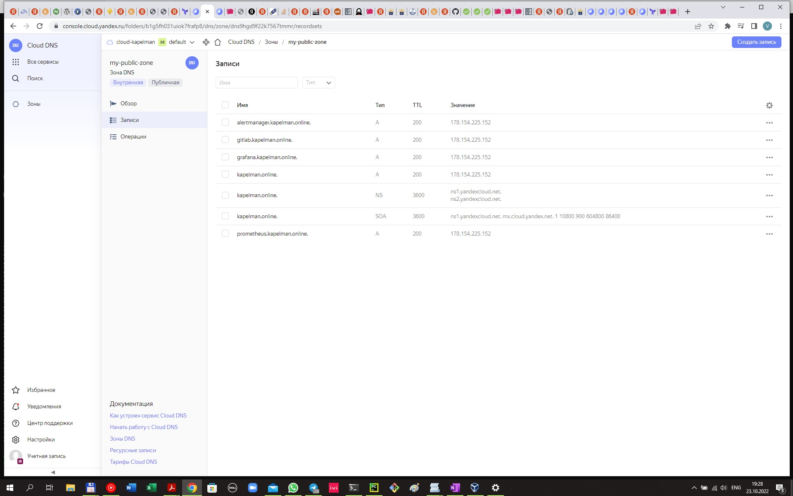

- для получения сертификата использовался certbot/
- готовую роль можно увидеть в репозитарии.
- ниже скрины https вызовов всех доменом. Соединение безопасное.
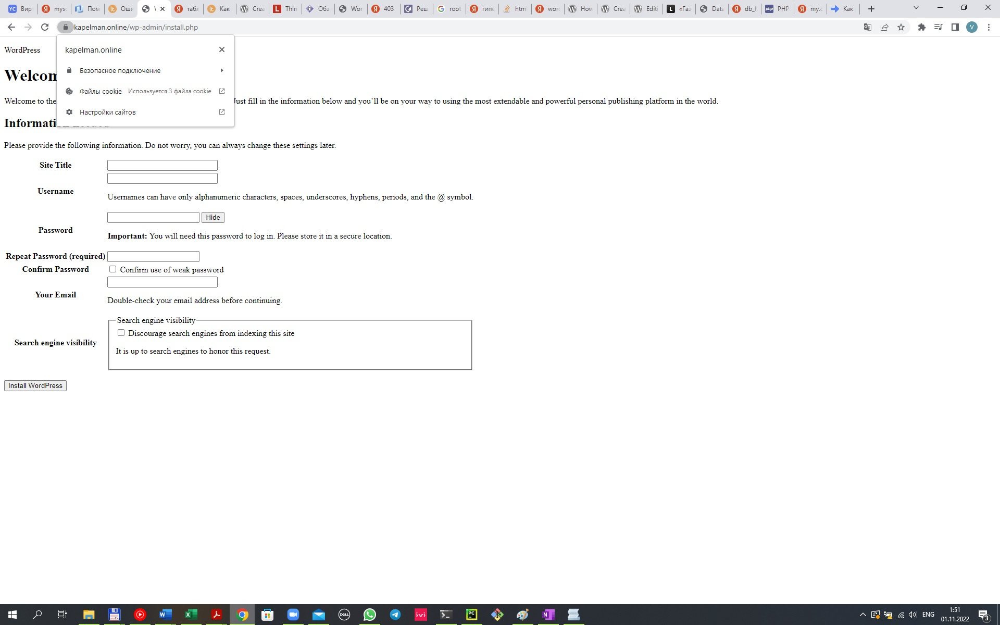

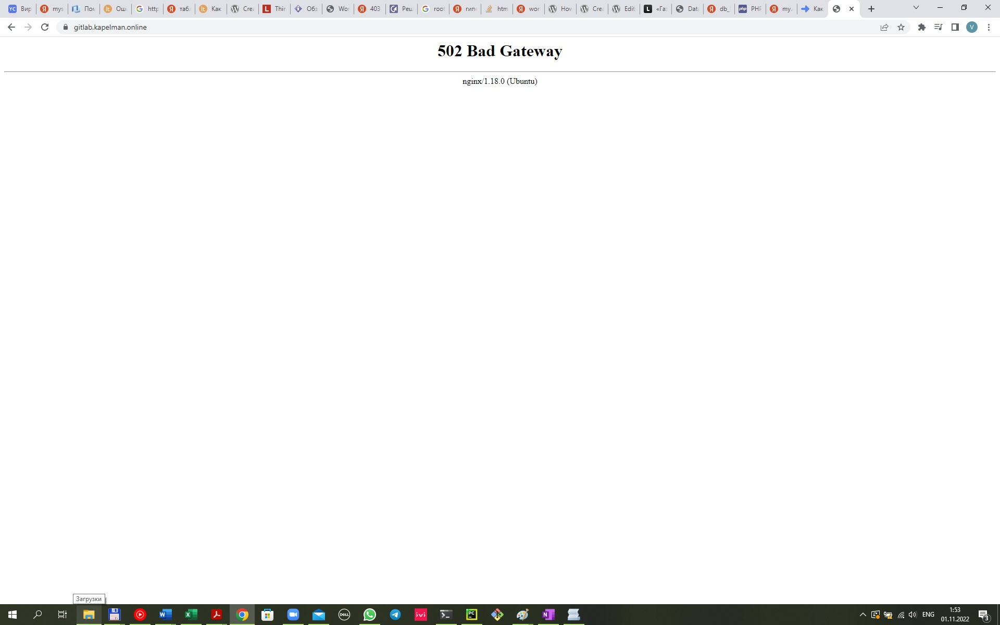
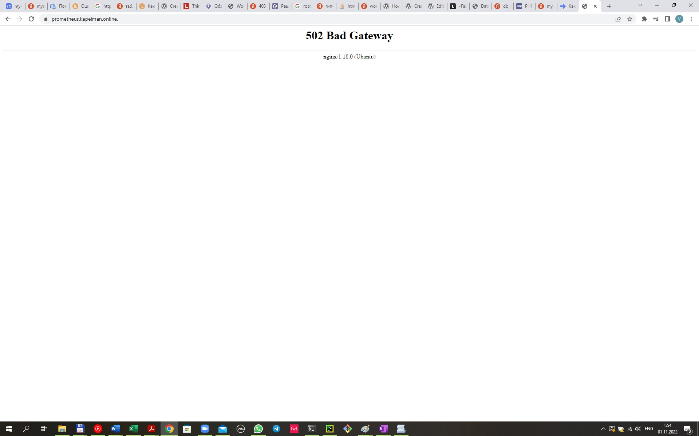
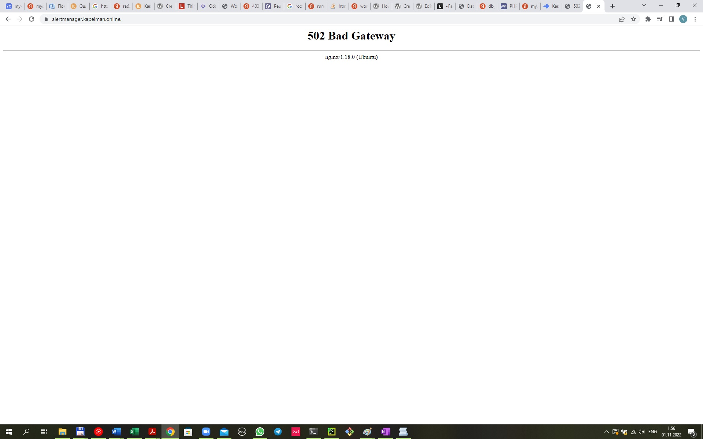

3. Установка кластера MySQL

Необходимо разработать Ansible роль для установки кластера MySQL.

Рекомендации:

• Имена серверов: db01.you.domain и db02.you.domain
• Характеристики: 4vCPU, 4 RAM, Internal address.

Цель:

Получить отказоустойчивый кластер баз данных MySQL.
Ожидаемые результаты:

MySQL работает в режиме репликации Master/Slave.
В кластере автоматически создаётся база данных c именем wordpress.
В кластере автоматически создаётся пользователь wordpress с полными правами на базу wordpress и паролем wordpress.
Вы должны понимать, что в рамках обучения это допустимые значения, но в боевой среде использование подобных значений не приемлимо! Считается хорошей практикой использовать логины и пароли повышенного уровня сложности. В которых будут содержаться буквы верхнего и нижнего регистров, цифры, а также специальные символы!

Решение:
- Добавим два новых хоста для MySql c помощью Terraform (node02-01.tf и node02-02.tf)

- загрузим требуемый модуль Ansible
```
vagrant@vagrant:~/diplom/ansible/mysql$ ansible-galaxy collection install community.mysql
Starting galaxy collection install process
Process install dependency map
Starting collection install process
Downloading https://galaxy.ansible.com/download/community-mysql-3.5.1.tar.gz to /home/vagrant/.ansible/tmp/ansible-local-173814vlawjkd3/tmpnzgpin23/community-mysql-3.5.1-hbi0pbud
Installing 'community.mysql:3.5.1' to '/home/vagrant/.ansible/collections/ansible_collections/community/mysql'
community.mysql:3.5.1 was installed successfully
vagrant@vagrant:~/diplom/ansible/mysql$ ansible-galaxy collection list

# /home/vagrant/.ansible/collections/ansible_collections
Collection        Version
----------------- -------
community.general 5.7.0
community.mysql   3.5.1
```
- создадим две роли для primary и secondary сервера базы данных:
```
drwxrwxr-x 5 vagrant vagrant 4096 Oct 27 13:41 mysqlprim
drwxrwxr-x 5 vagrant vagrant 4096 Oct 27 13:44 mysqlsecon
```
- роли mysqlprim и mysqlsecon можно посмотреть в репозитарии
- результат - primary хост реплицирует данные. Попробуем создать тестовую таблицу:
```
mysql> use wordpress;
Database changed
mysql> CREATE TABLE example_table (
    -> example_column varchar(30)
    -> );
Query OK, 0 rows affected (0.06 sec)

mysql> INSERT INTO example_table VALUES
    -> ('This is the first row'),
    -> ('This is the second row'),
    -> ('This is the third row');
Query OK, 3 rows affected (0.01 sec)
Records: 3  Duplicates: 0  Warnings: 0
```
- реплика содержит базу данных, тестовую таблицу и записи:
```
mysql> start replica;
Query OK, 0 rows affected (0.03 sec)

mysql> SHOW REPLICA STATUS\G;
*************************** 1. row ***************************
             Replica_IO_State: Waiting for source to send event
                  Source_Host: 192.168.101.12
                  Source_User: replica
                  Source_Port: 3306
                Connect_Retry: 60
              Source_Log_File: mysql-bin.000007
          Read_Source_Log_Pos: 1900
               Relay_Log_File: mysql-relay-bin.000012
                Relay_Log_Pos: 326
        Relay_Source_Log_File: mysql-bin.000007
           Replica_IO_Running: Yes
          Replica_SQL_Running: Yes
              Replicate_Do_DB:
          Replicate_Ignore_DB:
           Replicate_Do_Table:
       Replicate_Ignore_Table:
      Replicate_Wild_Do_Table:
  Replicate_Wild_Ignore_Table:
                   Last_Errno: 0
                   Last_Error:
                 Skip_Counter: 0
          Exec_Source_Log_Pos: 1900
              Relay_Log_Space: 2495
              Until_Condition: None
               Until_Log_File:
                Until_Log_Pos: 0
           Source_SSL_Allowed: No
           Source_SSL_CA_File:
           Source_SSL_CA_Path:
              Source_SSL_Cert:
            Source_SSL_Cipher:
               Source_SSL_Key:
        Seconds_Behind_Source: 0
Source_SSL_Verify_Server_Cert: No
                Last_IO_Errno: 0
                Last_IO_Error:
               Last_SQL_Errno: 0
               Last_SQL_Error:
  Replicate_Ignore_Server_Ids:
             Source_Server_Id: 1
                  Source_UUID: 46f3a6a5-551f-11ed-a20e-d00d9c8cf552
             Source_Info_File: mysql.slave_master_info
                    SQL_Delay: 0
          SQL_Remaining_Delay: NULL
    Replica_SQL_Running_State: Replica has read all relay log; waiting for more updates
           Source_Retry_Count: 86400
                  Source_Bind:
      Last_IO_Error_Timestamp:
     Last_SQL_Error_Timestamp:
               Source_SSL_Crl:
           Source_SSL_Crlpath:
           Retrieved_Gtid_Set:
            Executed_Gtid_Set:
                Auto_Position: 0
         Replicate_Rewrite_DB:
                 Channel_Name:
           Source_TLS_Version:
       Source_public_key_path:
        Get_Source_public_key: 1
            Network_Namespace:
1 row in set (0.00 sec)

ERROR:
No query specified
```
```
mysql> SHOW REPLICA STATUS\G;
*************************** 1. row ***************************
             Replica_IO_State: Waiting for source to send event
                  Source_Host: 192.168.101.12
                  Source_User: replica
                  Source_Port: 3306
                Connect_Retry: 60
              Source_Log_File: mysql-bin.000007
          Read_Source_Log_Pos: 2100
               Relay_Log_File: mysql-relay-bin.000012
                Relay_Log_Pos: 526
        Relay_Source_Log_File: mysql-bin.000007
           Replica_IO_Running: Yes
          Replica_SQL_Running: Yes
              Replicate_Do_DB:
          Replicate_Ignore_DB:
           Replicate_Do_Table:
       Replicate_Ignore_Table:
      Replicate_Wild_Do_Table:
  Replicate_Wild_Ignore_Table:
                   Last_Errno: 0
                   Last_Error:
                 Skip_Counter: 0
          Exec_Source_Log_Pos: 2100
              Relay_Log_Space: 2695
              Until_Condition: None
               Until_Log_File:
                Until_Log_Pos: 0
           Source_SSL_Allowed: No
           Source_SSL_CA_File:
           Source_SSL_CA_Path:
              Source_SSL_Cert:
            Source_SSL_Cipher:
               Source_SSL_Key:
        Seconds_Behind_Source: 0
Source_SSL_Verify_Server_Cert: No
                Last_IO_Errno: 0
                Last_IO_Error:
               Last_SQL_Errno: 0
               Last_SQL_Error:
  Replicate_Ignore_Server_Ids:
             Source_Server_Id: 1
                  Source_UUID: 46f3a6a5-551f-11ed-a20e-d00d9c8cf552
             Source_Info_File: mysql.slave_master_info
                    SQL_Delay: 0
          SQL_Remaining_Delay: NULL
    Replica_SQL_Running_State: Replica has read all relay log; waiting for more updates
           Source_Retry_Count: 86400
                  Source_Bind:
      Last_IO_Error_Timestamp:
     Last_SQL_Error_Timestamp:
               Source_SSL_Crl:
           Source_SSL_Crlpath:
           Retrieved_Gtid_Set:
            Executed_Gtid_Set:
                Auto_Position: 0
         Replicate_Rewrite_DB:
                 Channel_Name:
           Source_TLS_Version:
       Source_public_key_path:
        Get_Source_public_key: 1
            Network_Namespace:
1 row in set (0.00 sec)

ERROR:
No query specified
```
```
mysql> use wordpress;
Reading table information for completion of table and column names
You can turn off this feature to get a quicker startup with -A

Database changed
mysql> show tables;
+---------------------+
| Tables_in_wordpress |
+---------------------+
| example_table       |
+---------------------+
1 row in set (0.00 sec)

mysql> select * from example_table;
+------------------------+
| example_column         |
+------------------------+
| This is the first row  |
| This is the second row |
| This is the third row  |
+------------------------+
3 rows in set (0.00 sec)
```
4. Установка WordPress

Необходимо разработать Ansible роль для установки WordPress.

Рекомендации:

• Имя сервера: app.you.domain
• Характеристики: 4vCPU, 4 RAM, Internal address.

Цель:

Установить WordPress. Это система управления содержимым сайта (CMS) с открытым исходным кодом.
По данным W3techs, WordPress используют 64,7% всех веб-сайтов, которые сделаны на CMS. Это 41,1% всех существующих в мире сайтов. Эту платформу для своих блогов используют The New York Times и Forbes. Такую популярность WordPress получил за удобство интерфейса и большие возможности.

Ожидаемые результаты:

Виртуальная машина на которой установлен WordPress и Nginx/Apache (на ваше усмотрение).
В вашей доменной зоне настроена A-запись на внешний адрес reverse proxy:
https://www.you.domain (WordPress)
На сервере you.domain отредактирован upstream для выше указанного URL и он смотрит на виртуальную машину на которой установлен WordPress.
В браузере можно открыть URL https://www.you.domain и увидеть главную страницу WordPress.

Решение:
- виртуальную машину для wordpress создадим с помощью terraform (файл node03.tf)
- создадим новую роль wordpress
```
vagrant@vagrant:~/diplom/ansible$ molecule init role 'kapelman.wordpress' --driver-name docker
INFO     Initializing new role wordpress...
Using /etc/ansible/ansible.cfg as config file 
Role wordpress was created successfully
localhost | CHANGED => {"backup": "","changed": true,"msg": "line added"}
INFO     Initialized role in /home/vagrant/diplom/ansible/wordpress successfully.
```
```vagrant@vagrant:~/diplom/final/ansible/roles/wordpress$ ls -al
total 24
drwxrwxr-x 6 vagrant vagrant 4096 Oct 24 21:11 .
drwxrwxr-x 8 vagrant vagrant 4096 Nov  2 21:29 ..
drwxrwxr-x 2 vagrant vagrant 4096 Oct 24 21:11 files
drwxrwxr-x 2 vagrant vagrant 4096 Nov  2 22:00 tasks
drwxrwxr-x 2 vagrant vagrant 4096 Oct 31 22:51 templates
drwxrwxr-x 2 vagrant vagrant 4096 Nov  2 21:40 vars

```
- саму роль можно посмотреть в репозитарии. 

- Результат вызова домена  https://kapelman.online

 


5. Установка Gitlab CE и Gitlab Runner

Необходимо настроить CI/CD систему для автоматического развертывания приложения при изменении кода.

Рекомендации:

• Имена серверов: gitlab.you.domain и runner.you.domain
• Характеристики: 4vCPU, 4 RAM, Internal address.

Цель:

Построить pipeline доставки кода в среду эксплуатации, то есть настроить автоматический деплой на сервер app.you.domain при коммите в репозиторий с WordPress.
Подробнее о Gitlab CI
Ожидаемый результат:

Интерфейс Gitlab доступен по https.
В вашей доменной зоне настроена A-запись на внешний адрес reverse proxy:
https://gitlab.you.domain (Gitlab)
На сервере you.domain отредактирован upstream для выше указанного URL и он смотрит на виртуальную машину на которой установлен Gitlab.
При любом коммите в репозиторий с WordPress и создании тега (например, v1.0.0) происходит деплой на виртуальную машину.


Решение:
- настроим машины с помощью скриптов node05.tf(gitlab) и node06.tf(runner). Файлы в репозитарии.
- установим зависимости 
```
ubuntu@gitlab:~$ sudo apt-get install curl ca-certificates postfix
Reading package lists... Done
Building dependency tree... Done
Reading state information... Done
ca-certificates is already the newest version (20211016).
ca-certificates set to manually installed.
curl is already the newest version (7.81.0-1ubuntu1.4).
The following packages were automatically installed and are no longer required:
  linux-headers-5.15.0-43 linux-headers-5.15.0-43-generic linux-image-5.15.0-43-generic linux-modules-5.15.0-43-generic linux-modules-extra-5.15.0-43-generic
Use 'sudo apt autoremove' to remove them.
The following additional packages will be installed:
  ssl-cert
Suggested packages:
  procmail postfix-mysql postfix-pgsql postfix-ldap postfix-pcre postfix-lmdb postfix-sqlite sasl2-bin | dovecot-common resolvconf postfix-cdb mail-reader postfix-mta-sts-resolver postfix-doc
The following NEW packages will be installed:
  postfix ssl-cert
0 upgraded, 2 newly installed, 0 to remove and 3 not upgraded.
Need to get 1,263 kB of archives.
After this operation, 4,246 kB of additional disk space will be used.
Do you want to continue? [Y/n] y
Get:1 http://ru.archive.ubuntu.com/ubuntu jammy/main amd64 ssl-cert all 1.1.2 [17.4 kB]
Get:2 http://ru.archive.ubuntu.com/ubuntu jammy/main amd64 postfix amd64 3.6.4-1ubuntu1 [1,245 kB]
Fetched 1,263 kB in 0s (16.7 MB/s)
Preconfiguring packages ...
Selecting previously unselected package ssl-cert.
(Reading database ... 152019 files and directories currently installed.)
Preparing to unpack .../ssl-cert_1.1.2_all.deb ...
Unpacking ssl-cert (1.1.2) ...
Selecting previously unselected package postfix.
Preparing to unpack .../postfix_3.6.4-1ubuntu1_amd64.deb ...
Unpacking postfix (3.6.4-1ubuntu1) ...
Setting up ssl-cert (1.1.2) ...
Setting up postfix (3.6.4-1ubuntu1) ...
Adding group `postfix' (GID 120) ...
Done.
Adding system user `postfix' (UID 114) ...
Adding new user `postfix' (UID 114) with group `postfix' ...
Not creating home directory `/var/spool/postfix'.
Creating /etc/postfix/dynamicmaps.cf
Adding group `postdrop' (GID 121) ...
Done.
setting myhostname: gitlab.kapelman.online
setting alias maps
setting alias database
changing /etc/mailname to gitlab.kapelman.online
setting myorigin
setting destinations: $myhostname, gitlab.kapelman.online, localhost.kapelman.online, , localhost
setting relayhost:
setting mynetworks: 127.0.0.0/8 [::ffff:127.0.0.0]/104 [::1]/128
setting mailbox_size_limit: 0
setting recipient_delimiter: +
setting inet_interfaces: all
setting inet_protocols: all
/etc/aliases does not exist, creating it.
WARNING: /etc/aliases exists, but does not have a root alias.

Postfix (main.cf) is now set up with a default configuration.  If you need to
make changes, edit /etc/postfix/main.cf (and others) as needed.  To view
Postfix configuration values, see postconf(1).

After modifying main.cf, be sure to run 'systemctl reload postfix'.

Running newaliases
Created symlink /etc/systemd/system/multi-user.target.wants/postfix.service → /lib/systemd/system/postfix.service.
Processing triggers for ufw (0.36.1-4build1) ...
Processing triggers for man-db (2.10.2-1) ...
Processing triggers for rsyslog (8.2112.0-2ubuntu2.2) ...
Scanning processes...
Scanning linux images...

Running kernel seems to be up-to-date.

No services need to be restarted.

No containers need to be restarted.

No user sessions are running outdated binaries.

No VM guests are running outdated hypervisor (qemu) binaries on this host.
```
- подключим репозитарий
```
ubuntu@gitlab:~$ curl https://packages.gitlab.com/install/repositories/gitlab/gitlab-ce/script.deb.sh | sudo bash
  % Total    % Received % Xferd  Average Speed   Time    Time     Time  Current
                                 Dload  Upload   Total   Spent    Left  Speed
100  6865  100  6865    0     0  19876      0 --:--:-- --:--:-- --:--:-- 19841
Detected operating system as Ubuntu/jammy.
Checking for curl...
Detected curl...
Checking for gpg...
Detected gpg...
Running apt-get update... done.
Installing apt-transport-https... done.
Installing /etc/apt/sources.list.d/gitlab_gitlab-ce.list...done.
Importing packagecloud gpg key... done.
Running apt-get update... done.

The repository is setup! You can now install packages.

```
- установим gitlab

```buildoutcfg
ubuntu@gitlab:~$ sudo apt install gitlab-ce
Reading package lists... Done
Building dependency tree... Done
Reading state information... Done
ca-certificates is already the newest version (20211016).
ca-certificates set to manually installed.
curl is already the newest version (7.81.0-1ubuntu1.4).
The following packages were automatically installed and are no longer required:
  linux-headers-5.15.0-43 linux-headers-5.15.0-43-generic linux-image-5.15.0-43-generic linux-modules-5.15.0-43-generic linux-modules-extra-5.15.0-43-generic
Use 'sudo apt autoremove' to remove them.
The following additional packages will be installed:
  ssl-cert
Suggested packages:
  procmail postfix-mysql postfix-pgsql postfix-ldap postfix-pcre postfix-lmdb postfix-sqlite sasl2-bin | dovecot-common resolvconf postfix-cdb mail-reader postfix-mta-sts-resolver postfix-doc
The following NEW packages will be installed:
  postfix ssl-cert
0 upgraded, 2 newly installed, 0 to remove and 3 not upgraded.
Need to get 1,263 kB of archives.
After this operation, 4,246 kB of additional disk space will be used.
Do you want to continue? [Y/n] y
Get:1 http://ru.archive.ubuntu.com/ubuntu jammy/main amd64 ssl-cert all 1.1.2 [17.4 kB]
Get:2 http://ru.archive.ubuntu.com/ubuntu jammy/main amd64 postfix amd64 3.6.4-1ubuntu1 [1,245 kB]
Fetched 1,263 kB in 0s (16.7 MB/s)
Preconfiguring packages ...
Selecting previously unselected package ssl-cert.
(Reading database ... 152019 files and directories currently installed.)
Preparing to unpack .../ssl-cert_1.1.2_all.deb ...
Unpacking ssl-cert (1.1.2) ...
Selecting previously unselected package postfix.
Preparing to unpack .../postfix_3.6.4-1ubuntu1_amd64.deb ...
Unpacking postfix (3.6.4-1ubuntu1) ...
Setting up ssl-cert (1.1.2) ...
Setting up postfix (3.6.4-1ubuntu1) ...
Adding group `postfix' (GID 120) ...
Done.
Adding system user `postfix' (UID 114) ...
Adding new user `postfix' (UID 114) with group `postfix' ...
Not creating home directory `/var/spool/postfix'.
Creating /etc/postfix/dynamicmaps.cf
Adding group `postdrop' (GID 121) ...
Done.
setting myhostname: gitlab.kapelman.online
setting alias maps
setting alias database
changing /etc/mailname to gitlab.kapelman.online
setting myorigin
setting destinations: $myhostname, gitlab.kapelman.online, localhost.kapelman.online, , localhost
setting relayhost:
setting mynetworks: 127.0.0.0/8 [::ffff:127.0.0.0]/104 [::1]/128
setting mailbox_size_limit: 0
setting recipient_delimiter: +
setting inet_interfaces: all
setting inet_protocols: all
/etc/aliases does not exist, creating it.
WARNING: /etc/aliases exists, but does not have a root alias.

Postfix (main.cf) is now set up with a default configuration.  If you need to
make changes, edit /etc/postfix/main.cf (and others) as needed.  To view
Postfix configuration values, see postconf(1).

After modifying main.cf, be sure to run 'systemctl reload postfix'.

Running newaliases
Created symlink /etc/systemd/system/multi-user.target.wants/postfix.service → /lib/systemd/system/postfix.service.
Processing triggers for ufw (0.36.1-4build1) ...
Processing triggers for man-db (2.10.2-1) ...
Processing triggers for rsyslog (8.2112.0-2ubuntu2.2) ...
Scanning processes...
Scanning linux images...

Running kernel seems to be up-to-date.

No services need to be restarted.

No containers need to be restarted.

No user sessions are running outdated binaries.
The following NEW packages will be installed:
  gitlab-ce
0 upgraded, 1 newly installed, 0 to remove and 22 not upgraded.
Need to get 1,146 MB of archives.
After this operation, 3,065 MB of additional disk space will be used.
Get:1 https://packages.gitlab.com/gitlab/gitlab-ce/ubuntu jammy/main amd64 gitlab-ce amd64 15.5.2-ce.0 [1,146 MB]
Fetched 1,146 MB in 1min 12s (15.8 MB/s)
Selecting previously unselected package gitlab-ce.
(Reading database ... 152234 files and directories currently installed.)
Preparing to unpack .../gitlab-ce_15.5.2-ce.0_amd64.deb ...
Unpacking gitlab-ce (15.5.2-ce.0) ...
Setting up gitlab-ce (15.5.2-ce.0) ...
It looks like GitLab has not been configured yet; skipping the upgrade script.

       *.                  *.
      ***                 ***
     *****               *****
    .******             *******
    ********            ********
   ,,,,,,,,,***********,,,,,,,,,
  ,,,,,,,,,,,*********,,,,,,,,,,,
  .,,,,,,,,,,,*******,,,,,,,,,,,,
      ,,,,,,,,,*****,,,,,,,,,.
         ,,,,,,,****,,,,,,
            .,,,***,,,,
                ,*,.


     _______ __  __          __
    / ____(_) /_/ /   ____ _/ /_
   / / __/ / __/ /   / __ `/ __ \
  / /_/ / / /_/ /___/ /_/ / /_/ /
Thank you for installing GitLab!
GitLab was unable to detect a valid hostname for your instance.
Please configure a URL for your GitLab instance by setting `external_url`
configuration in /etc/gitlab/gitlab.rb file.
Then, you can start your GitLab instance by running the following command:
  sudo gitlab-ctl reconfigure

For a comprehensive list of configuration options please see the Omnibus GitLab readme
https://gitlab.com/gitlab-org/omnibus-gitlab/blob/master/README.md

Help us improve the installation experience, let us know how we did with a 1 minute survey:
https://gitlab.fra1.qualtrics.com/jfe/form/SV_6kVqZANThUQ1bZb?installation=omnibus&release=15-5

The following NEW packages will be installed:
  gitlab-ce
0 upgraded, 1 newly installed, 0 to remove and 22 not upgraded.
Need to get 1,146 MB of archives.
After this operation, 3,065 MB of additional disk space will be used.
Get:1 https://packages.gitlab.com/gitlab/gitlab-ce/ubuntu jammy/main amd64 gitlab-ce amd64 15.5.2-ce.0 [1,146 MB]
Fetched 1,146 MB in 1min 17s (14.9 MB/s)
Selecting previously unselected package gitlab-ce.
(Reading database ... 152234 files and directories currently installed.)
Preparing to unpack .../gitlab-ce_15.5.2-ce.0_amd64.deb ...
Unpacking gitlab-ce (15.5.2-ce.0) ...
Setting up gitlab-ce (15.5.2-ce.0) ...
It looks like GitLab has not been configured yet; skipping the upgrade script.

       *.                  *.
      ***                 ***
     *****               *****
    .******             *******
    ********            ********
   ,,,,,,,,,***********,,,,,,,,,
  ,,,,,,,,,,,*********,,,,,,,,,,,
  .,,,,,,,,,,,*******,,,,,,,,,,,,
      ,,,,,,,,,*****,,,,,,,,,.
         ,,,,,,,****,,,,,,
            .,,,***,,,,
                ,*,.


     _______ __  __          __
    / ____(_) /_/ /   ____ _/ /_
   / / __/ / __/ /   / __ `/ __ \
  / /_/ / / /_/ /___/ /_/ / /_/ /
  \____/_/\__/_____/\__,_/_.___/


Thank you for installing GitLab!
GitLab was unable to detect a valid hostname for your instance.
Please configure a URL for your GitLab instance by setting `external_url`
configuration in /etc/gitlab/gitlab.rb file.
Then, you can start your GitLab instance by running the following command:
  sudo gitlab-ctl reconfigure

For a comprehensive list of configuration options please see the Omnibus GitLab readme
https://gitlab.com/gitlab-org/omnibus-gitlab/blob/master/README.md

Help us improve the installation experience, let us know how we did with a 1 minute survey:
https://gitlab.fra1.qualtrics.com/jfe/form/SV_6kVqZANThUQ1bZb?installation=omnibus&release=15-5

Scanning processes...
Scanning linux images...

Running kernel seems to be up-to-date.

No services need to be restarted.

No containers need to be restarted.

No user sessions are running outdated binaries.

No VM guests are running outdated hypervisor (qemu) binaries on this host.
```
 - Конфигурируем веб-адрес gitlab.kapelman.online /etc/gitlab/gitlab.rb 
ubuntu@gitlab:~$ sudo nano /etc/gitlab/gitlab.rb

 - запусти реконфигурацию sudo gitlab-ctl reconfigure
 - смотрит пароль и заходим в gitlab
ubuntu@gitlab:/etc/nginx/sites-enabled$ sudo cat /etc/gitlab/initial_root_password | grep Password:
Password: CXIOirVAq4YPxvU6IFYXIfJ4+2rV4a6d2/CEnWRgWQg=


- создадим проект wordpress
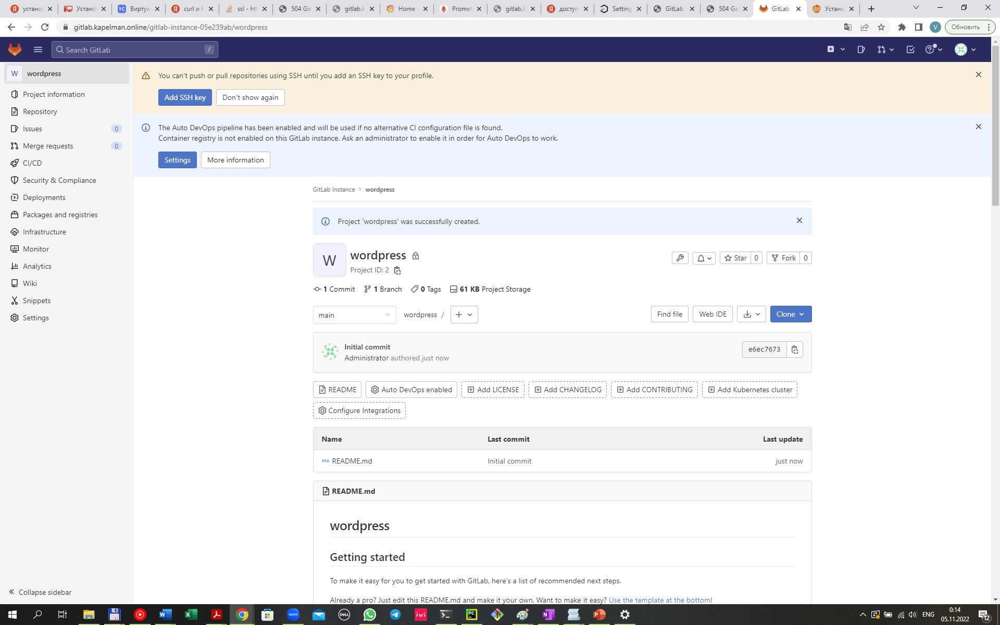
- установим gitlab runner. Настройка репозитория

```
ubuntu@runner:~$ curl -L "https://packages.gitlab.com/install/repositories/runner/gitlab-runner/script.deb.sh" | sudo bash
  % Total    % Received % Xferd  Average Speed   Time    Time     Time  Current
                                 Dload  Upload   Total   Spent    Left  Speed
100  6885  100  6885    0     0  20876      0 --:--:-- --:--:-- --:--:-- 21055
Detected operating system as Ubuntu/jammy.
Checking for curl...
Detected curl...
Checking for gpg...
Detected gpg...
Running apt-get update... done.
Installing apt-transport-https... done.
Installing /etc/apt/sources.list.d/runner_gitlab-runner.list...done.
Importing packagecloud gpg key... done.
Running apt-get update... done.

The repository is setup! You can now install packages.
```
- установим runner
```
ubuntu@runner:~$ sudo apt-get install gitlab-runner
Reading package lists... Done
Building dependency tree... Done
Reading state information... Done
Suggested packages:
  docker-engine
The following NEW packages will be installed:
  gitlab-runner
0 upgraded, 1 newly installed, 0 to remove and 22 not upgraded.
Need to get 441 MB of archives.
After this operation, 477 MB of additional disk space will be used.
Get:1 https://packages.gitlab.com/runner/gitlab-runner/ubuntu jammy/main amd64 gitlab-runner amd64 15.5.0 [441 MB]
Fetched 441 MB in 33s (13.5 MB/s)
Selecting previously unselected package gitlab-runner.
(Reading database ... 116545 files and directories currently installed.)
Preparing to unpack .../gitlab-runner_15.5.0_amd64.deb ...
Unpacking gitlab-runner (15.5.0) ...
Setting up gitlab-runner (15.5.0) ...
GitLab Runner: creating gitlab-runner...
Home directory skeleton not used
Runtime platform                                    arch=amd64 os=linux pid=3793 revision=0d4137b8 version=15.5.0
gitlab-runner: the service is not installed
Runtime platform                                    arch=amd64 os=linux pid=3802 revision=0d4137b8 version=15.5.0
gitlab-ci-multi-runner: the service is not installed
Runtime platform                                    arch=amd64 os=linux pid=3829 revision=0d4137b8 version=15.5.0
Runtime platform                                    arch=amd64 os=linux pid=3903 revision=0d4137b8 version=15.5.0
INFO: Docker installation not found, skipping clear-docker-cache
Scanning processes...
Scanning linux images...

Running kernel seems to be up-to-date.

No services need to be restarted.

No containers need to be restarted.

No user sessions are running outdated binaries.

No VM guests are running outdated hypervisor (qemu) binaries on this host.
```

- зарегистрируем runner
```
ubuntu@runner:~/.ssh$ sudo gitlab-runner register
Runtime platform                                    arch=amd64 os=linux pid=13629 revision=0d4137b8 version=15.5.0
Running in system-mode.

Enter the GitLab instance URL (for example, https://gitlab.com/):
http://gitlab/
Enter the registration token:
GR1348941ksirXUzwcrmc3kQBnVFv
Enter a description for the runner:
[runner]: wordpress
Enter tags for the runner (comma-separated):
wordpress
Enter optional maintenance note for the runner:
wordpress
Registering runner... succeeded                     runner=GR1348941ksirXUzw
Enter an executor: docker, docker-ssh, virtualbox, docker-ssh+machine, instance, custom, parallels, shell, ssh, docker+machine, kubernetes:
shell
Runner registered successfully. Feel free to start it, but if it's running already the config should be automatically reloaded!

Configuration (with the authentication token) was saved in "/etc/gitlab-runner/config.toml"

```

зарегистрированный runner 

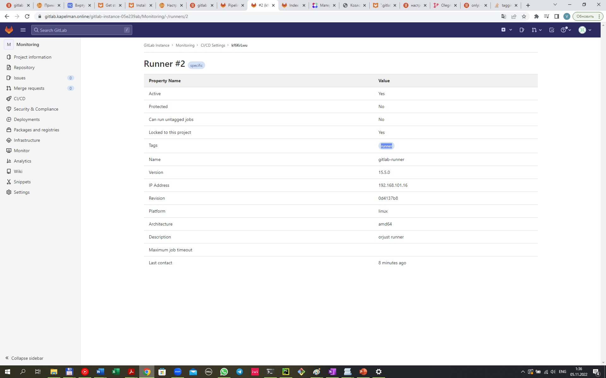

- сгенерим ключи ssh для доступа пользователя gitlab-runner на app.kapelman.online (продуктивная среда для wordpress)

-создадим пользователя gitlab-runner на app.kapelman.online
```
root@app:/home/ubuntu/.ssh# adduser gitlab-runner
Adding user `gitlab-runner' ...
Adding new group `gitlab-runner' (1003) ...
Adding new user `gitlab-runner' (1002) with group `gitlab-runner' ...
Creating home directory `/home/gitlab-runner' ...
Copying files from `/etc/skel' ...
New password:
Retype new password:
passwd: password updated successfully
Changing the user information for gitlab-runner
Enter the new value, or press ENTER for the default
        Full Name []: gitlab-runner
        Room Number []: gitlab-runner
        Work Phone []: gitlab-runner
        Home Phone []: gitlab-runner
        Other []: gitlab-runner
Is the information correct? [Y/n] Y
root@app:/home/ubuntu/.ssh# sudo su gitlab-runner
gitlab-runner@app:/home/ubuntu/.ssh$ cd ~
gitlab-runner@app:~$ ls -al
total 20
drwxr-x--- 2 gitlab-runner gitlab-runner 4096 Nov  5 11:33 .
drwxr-xr-x 4 root          root          4096 Nov  5 11:33 ..
-rw-r--r-- 1 gitlab-runner gitlab-runner  220 Nov  5 11:33 .bash_logout
-rw-r--r-- 1 gitlab-runner gitlab-runner 3771 Nov  5 11:33 .bashrc
-rw-r--r-- 1 gitlab-runner gitlab-runner  807 Nov  5 11:33 .profile
gitlab-runner@app:~$ mkdir .ssh
gitlab-runner@app:~$ cd .ssh
gitlab-runner@app:~/.ssh$ nano authorized_keys
```

- добавим публичный ключ ssh на app.kapelman.online, авторизация проходит
```
gitlab-runner@runner:~/.ssh$ ssh gitlab-runner@app.kapelman.online
The authenticity of host 'app.kapelman.online (192.168.101.14)' can't be established.
ED25519 key fingerprint is SHA256:l8X+n9f/kg16S9APpBddam4UwCPIWEax0sSC49d/iTU.
This key is not known by any other names
Are you sure you want to continue connecting (yes/no/[fingerprint])? yes
Warning: Permanently added 'app.kapelman.online' (ED25519) to the list of known hosts.
Welcome to Ubuntu 22.04.1 LTS (GNU/Linux 5.15.0-52-generic x86_64)

 * Documentation:  https://help.ubuntu.com
 * Management:     https://landscape.canonical.com
 * Support:        https://ubuntu.com/advantage

  System information as of Sat Nov  5 11:36:36 AM UTC 2022

  System load:  0.0                Processes:             149
  Usage of /:   36.0% of 14.68GB   Users logged in:       2
  Memory usage: 31%                IPv4 address for eth0: 192.168.101.14
  Swap usage:   0%


4 updates can be applied immediately.
To see these additional updates run: apt list --upgradable


*** System restart required ***

The programs included with the Ubuntu system are free software;
the exact distribution terms for each program are described in the
individual files in /usr/share/doc/*/copyright.

Ubuntu comes with ABSOLUTELY NO WARRANTY, to the extent permitted by
applicable law.

gitlab-runner@app:~$
```
- поменяем владельца папки с wordpress на пользователя gitlab-runner
```
root@app:/home/ubuntu/.ssh# chown -R gitlab-runner:gitlab-runner /var/www/html/*
root@app:/var/www/html/wordpress# ls -la
total 224
drwxr-xr-x  5 gitlab-runner gitlab-runner  4096 Nov  5 11:50 .
drwxr-xr-x  4 gitlab-runner gitlab-runner  4096 Nov  5 11:44 ..
-rw-r--r--  1 gitlab-runner gitlab-runner   405 Feb  6  2020 index.php
-rw-r--r--  1 gitlab-runner gitlab-runner 19915 Jan  1  2022 license.txt
-rw-r--r--  1 gitlab-runner gitlab-runner  7401 Mar 22  2022 readme.html
-rw-r--r--  1 gitlab-runner gitlab-runner  7165 Jan 21  2021 wp-activate.php
drwxr-xr-x  9 gitlab-runner gitlab-runner  4096 Oct 17 21:10 wp-admin
-rw-r--r--  1 gitlab-runner gitlab-runner   351 Feb  6  2020 wp-blog-header.php
-rw-r--r--  1 gitlab-runner gitlab-runner  2338 Nov  9  2021 wp-comments-post.php
-rw-r--r--  1 gitlab-runner gitlab-runner  2741 Nov  4 18:51 wp-config.php
-rw-r--r--  1 gitlab-runner gitlab-runner  3001 Dec 14  2021 wp-config-sample.php
drwxr-xr-x  4 gitlab-runner gitlab-runner  4096 Oct 17 21:10 wp-content
-rw-r--r--  1 gitlab-runner gitlab-runner  3943 Apr 28  2022 wp-cron.php
drwxr-xr-x 26 gitlab-runner gitlab-runner 12288 Oct 17 21:10 wp-includes
-rw-r--r--  1 gitlab-runner gitlab-runner  2494 Mar 19  2022 wp-links-opml.php
-rw-r--r--  1 gitlab-runner gitlab-runner  3973 Apr 12  2022 wp-load.php
-rw-r--r--  1 gitlab-runner gitlab-runner 48498 Apr 29  2022 wp-login.php
-rw-r--r--  1 gitlab-runner gitlab-runner  8522 Oct 17 12:20 wp-mail.php
-rw-r--r--  1 gitlab-runner gitlab-runner 23706 Apr 12  2022 wp-settings.php
-rw-r--r--  1 gitlab-runner gitlab-runner 32051 Apr 11  2022 wp-signup.php
-rw-r--r--  1 gitlab-runner gitlab-runner  4817 Oct 17 12:29 wp-trackback.php
-rw-r--r--  1 gitlab-runner gitlab-runner  3236 Jun  8  2020 xmlrpc.php
```

- настроим pipeline, для дерплоя используем команду rsync
```
stages:          # List of stages for jobs, and their order of execution
  - deploy
  
deploy-job:      # This job runs in the deploy stage.
  stage: deploy
  script:
    - echo "Deploying application"
    - rsync -avzhe ssh $CI_PROJECT_DIR/ gitlab-runner@app.kapelman.online:/var/www/html/wordpress
    - only: [tags]
    - echo "The success"
  tags: [wordpress]
```
- добавим код wordpress в репозитарий. Для этого зайдем на машину app.kapelman.online

```
ubuntu@app:/var/www/html$ sudo git init
hint: Using 'master' as the name for the initial branch. This default branch name
hint: is subject to change. To configure the initial branch name to use in all
hint: of your new repositories, which will suppress this warning, call:
hint:
hint:   git config --global init.defaultBranch <name>
hint:
hint: Names commonly chosen instead of 'master' are 'main', 'trunk' and
hint: 'development'. The just-created branch can be renamed via this command:
hint:
hint:   git branch -m <name>
Initialized empty Git repository in /var/www/html/.git/
ubuntu@app:/var/www/html$ git status
fatal: detected dubious ownership in repository at '/var/www/html'
To add an exception for this directory, call:

        git config --global --add safe.directory /var/www/html
ubuntu@app:/var/www/html$ git config --global --add safe.directory /var/www/html
ubuntu@app:/var/www/html$ git status
On branch master

No commits yet

Untracked files:
  (use "git add <file>..." to include in what will be committed)
        index.html
        index.nginx-debian.html
        wordpress/

nothing added to commit but untracked files present (use "git add" to track)
ubuntu@app:/var/www/html$ git add /wordpress
fatal: Unable to create '/var/www/html/.git/index.lock': Permission denied
ubuntu@app:/var/www/html$ sudo git add /wordpress
fatal: /wordpress: '/wordpress' is outside repository at '/var/www/html'
ubuntu@app:/var/www/html$ sudo git add wordpress/
ubuntu@app:/var/www/html$ git status
On branch master

No commits yet

Changes to be committed:
  (use "git rm --cached <file>..." to unstage)
        new file:   wordpress/index.php
        new file:   wordpress/license.txt
        new file:   wordpress/readme.html
        new file:   wordpress/wp-activate.php
        new file:   wordpress/wp-admin/about.php
        new file:   wordpress/wp-admin/admin-ajax.php
        new file:   wordpress/wp-admin/admin-footer.php
        new file:   wordpress/wp-admin/admin-functions.php
        new file:   wordpress/wp-admin/admin-header.php
        new file:   wordpress/wp-admin/admin-post.php
        new file:   wordpress/wp-admin/admin.php
        new file:   wordpress/wp-admin/async-upload.php
```
- выполним начальный коммит и отправим первоначальную версию кода в репозитарий
```
ubuntu@app:/var/www/html$ sudo git commit -m "initial commit"
```

- отправим код в удаленный репозитарий на gitlab
```
ubuntu@app:/var/www/html$ git push -uf origin main
Username for 'http://gitlab.kapelman.online': root
Password for 'http://root@gitlab.kapelman.online':
Enumerating objects: 3103, done.
Counting objects: 100% (3103/3103), done.
Delta compression using up to 2 threads
Compressing objects: 100% (3035/3035), done.
Writing objects: 100% (3103/3103), 19.21 MiB | 6.42 MiB/s, done.
Total 3103 (delta 514), reused 0 (delta 0), pack-reused 0
remote: Resolving deltas: 100% (514/514), done.
To http://gitlab.kapelman.online/gitlab-instance-05e239ab/wordpress.git
 + 09737b7...fc0f852 main -> main (forced update)
error: could not lock config file .git/config: Permission denied
error: Unable to write upstream branch configuration
hint:
hint: After fixing the error cause you may try to fix up
hint: the remote tracking information by invoking
hint: "git branch --set-upstream-to=origin/main".
error: update_ref failed for ref 'refs/remotes/origin/main': cannot lock ref 'refs/remotes/origin/main': unable to create directory for .git/refs/remotes/origin/main
ubuntu@app:/var/www/html$ sudo git push -uf origin main
Username for 'http://gitlab.kapelman.online': root
Password for 'http://root@gitlab.kapelman.online':
Branch 'main' set up to track remote branch 'main' from 'origin'.
Everything up-to-date
```
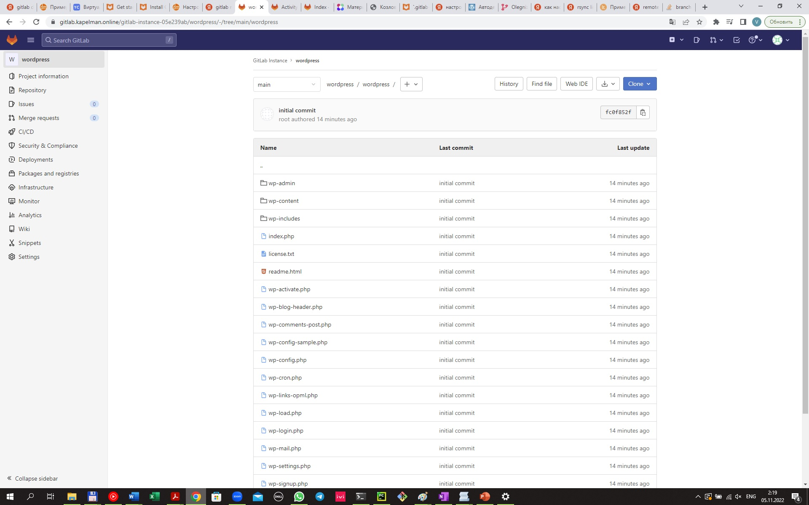
- 
- проверим деплой. На машине kapelman.online клонируем репозитарий, удалим два пустых файла и добавим новый тестовый
```
ubuntu@kapelman:~/test-commit$ sudo git clone http://gitlab.kapelman.online/gitlab-instance-05e239ab/wordpress.git
Cloning into 'wordpress'...
Username for 'http://gitlab.kapelman.online': root
Password for 'http://root@gitlab.kapelman.online':
remote: Enumerating objects: 3160, done.
remote: Counting objects: 100% (22/22), done.
remote: Compressing objects: 100% (20/20), done.
remote: Total 3160 (delta 5), reused 9 (delta 1), pack-reused 3138
Receiving objects: 100% (3160/3160), 19.22 MiB | 19.90 MiB/s, done.
Resolving deltas: 100% (530/530), done.
ubuntu@kapelman:~/test-commit$ ls -al
total 12
drwxrwxr-x 3 ubuntu ubuntu 4096 Nov  5 12:32 .
drwxr-x--- 7 ubuntu ubuntu 4096 Nov  5 12:31 ..
drwxr-xr-x 4 root   root   4096 Nov  5 12:32 wordpress
ubuntu@kapelman:~/test-commit$ cd wordpress/
ubuntu@kapelman:~/test-commit/wordpress$ ls -a;l
.  ..  .git  .gitlab-ci.yml  wordpress
wordpress/
ubuntu@kapelman:~/test-commit/wordpress$ cd wordpress/
ubuntu@kapelman:~/test-commit/wordpress/wordpress$ ls -al
total 224
drwxr-xr-x  5 root root  4096 Nov  5 12:32 .
drwxr-xr-x  4 root root  4096 Nov  5 12:32 ..
-rw-r--r--  1 root root     0 Nov  5 12:32 deploy.test
-rw-r--r--  1 root root   405 Nov  5 12:32 index.php
-rw-r--r--  1 root root 19915 Nov  5 12:32 license.txt
-rw-r--r--  1 root root  7401 Nov  5 12:32 readme.html
-rw-r--r--  1 root root     0 Nov  5 12:32 test2.kk
-rw-r--r--  1 root root  7165 Nov  5 12:32 wp-activate.php
drwxr-xr-x  9 root root  4096 Nov  5 12:32 wp-admin
-rw-r--r--  1 root root   351 Nov  5 12:32 wp-blog-header.php
-rw-r--r--  1 root root  2338 Nov  5 12:32 wp-comments-post.php
-rw-r--r--  1 root root  2741 Nov  5 12:32 wp-config.php
-rw-r--r--  1 root root  3001 Nov  5 12:32 wp-config-sample.php
drwxr-xr-x  4 root root  4096 Nov  5 12:32 wp-content
-rw-r--r--  1 root root  3943 Nov  5 12:32 wp-cron.php
drwxr-xr-x 26 root root 12288 Nov  5 12:32 wp-includes
-rw-r--r--  1 root root  2494 Nov  5 12:32 wp-links-opml.php
-rw-r--r--  1 root root  3973 Nov  5 12:32 wp-load.php
-rw-r--r--  1 root root 48498 Nov  5 12:32 wp-login.php
-rw-r--r--  1 root root  8522 Nov  5 12:32 wp-mail.php
-rw-r--r--  1 root root 23706 Nov  5 12:32 wp-settings.php
-rw-r--r--  1 root root 32051 Nov  5 12:32 wp-signup.php
-rw-r--r--  1 root root  4817 Nov  5 12:32 wp-trackback.php
-rw-r--r--  1 root root  3236 Nov  5 12:32 xmlrpc.php
ubuntu@kapelman:~/test-commit/wordpress/wordpress$ rm deploy.test test2.kk
rm: remove write-protected regular empty file 'deploy.test'? y
rm: cannot remove 'deploy.test': Permission denied
rm: remove write-protected regular empty file 'test2.kk'? yes
rm: cannot remove 'test2.kk': Permission denied
ubuntu@kapelman:~/test-commit/wordpress/wordpress$ sudo rm deploy.test test2.kk
ubuntu@kapelman:~/test-commit/wordpress/wordpress$ nano test.txt


ubuntu@kapelman:~/test-commit/wordpress/wordpress$ ls -al
total 228
drwxr-xr-x  5 root root  4096 Nov  5 12:34 .
drwxr-xr-x  4 root root  4096 Nov  5 12:32 ..
-rw-r--r--  1 root root   405 Nov  5 12:32 index.php
-rw-r--r--  1 root root 19915 Nov  5 12:32 license.txt
-rw-r--r--  1 root root  7401 Nov  5 12:32 readme.html
-rw-r--r--  1 root root    19 Nov  5 12:34 test.txt
-rw-r--r--  1 root root  7165 Nov  5 12:32 wp-activate.php
drwxr-xr-x  9 root root  4096 Nov  5 12:32 wp-admin
-rw-r--r--  1 root root   351 Nov  5 12:32 wp-blog-header.php
-rw-r--r--  1 root root  2338 Nov  5 12:32 wp-comments-post.php
-rw-r--r--  1 root root  2741 Nov  5 12:32 wp-config.php
-rw-r--r--  1 root root  3001 Nov  5 12:32 wp-config-sample.php
drwxr-xr-x  4 root root  4096 Nov  5 12:32 wp-content
-rw-r--r--  1 root root  3943 Nov  5 12:32 wp-cron.php
drwxr-xr-x 26 root root 12288 Nov  5 12:32 wp-includes
-rw-r--r--  1 root root  2494 Nov  5 12:32 wp-links-opml.php
-rw-r--r--  1 root root  3973 Nov  5 12:32 wp-load.php
-rw-r--r--  1 root root 48498 Nov  5 12:32 wp-login.php
-rw-r--r--  1 root root  8522 Nov  5 12:32 wp-mail.php
-rw-r--r--  1 root root 23706 Nov  5 12:32 wp-settings.php
-rw-r--r--  1 root root 32051 Nov  5 12:32 wp-signup.php
-rw-r--r--  1 root root  4817 Nov  5 12:32 wp-trackback.php
-rw-r--r--  1 root root  3236 Nov  5 12:32 xmlrpc.php
```
- добавим тэги и отправим удаленный репозиторий
```
ubuntu@kapelman:~/test-commit/wordpress$ git config --global --add safe.directory /home/ubuntu/test-commit/wordpress
ubuntu@kapelman:~/test-commit/wordpress$ git status
On branch main
Your branch is up to date with 'origin/main'.

Changes not staged for commit:
  (use "git add/rm <file>..." to update what will be committed)
  (use "git restore <file>..." to discard changes in working directory)
        deleted:    wordpress/deploy.test
        deleted:    wordpress/test2.kk

Untracked files:
  (use "git add <file>..." to include in what will be committed)
        wordpress/test.txt

no changes added to commit (use "git add" and/or "git commit -a")
ubuntu@kapelman:~/test-commit/wordpress$ git add *
fatal: Unable to create '/home/ubuntu/test-commit/wordpress/.git/index.lock': Permission denied
ubuntu@kapelman:~/test-commit/wordpress$ sudo git add *
ubuntu@kapelman:~/test-commit/wordpress$ git status
On branch main
Your branch is up to date with 'origin/main'.

Changes to be committed:
  (use "git restore --staged <file>..." to unstage)
        deleted:    wordpress/deploy.test
        new file:   wordpress/test.txt
        deleted:    wordpress/test2.kk

ubuntu@kapelman:~/test-commit/wordpress$ sudo git commit -m "prepare for v2.0.0 release"
[main e9fbaec] prepare for v2.0.0 release
 Committer: root <root@kapelman.online>
Your name and email address were configured automatically based
on your username and hostname. Please check that they are accurate.
You can suppress this message by setting them explicitly. Run the
following command and follow the instructions in your editor to edit
your configuration file:

    git config --global --edit

After doing this, you may fix the identity used for this commit with:

    git commit --amend --reset-author

 3 files changed, 1 insertion(+)
 delete mode 100644 wordpress/deploy.test
 create mode 100644 wordpress/test.txt
 delete mode 100644 wordpress/test2.kk

ubuntu@kapelman:~/test-commit/wordpress$ sudo git tag v2.0.0

ubuntu@kapelman:~/test-commit/wordpress$ sudo git push origin main --tags
Username for 'http://gitlab.kapelman.online': root
Password for 'http://root@gitlab.kapelman.online':
Enumerating objects: 6, done.
Counting objects: 100% (6/6), done.
Delta compression using up to 2 threads
Compressing objects: 100% (3/3), done.
Writing objects: 100% (4/4), 374 bytes | 374.00 KiB/s, done.
Total 4 (delta 1), reused 0 (delta 0), pack-reused 0
To http://gitlab.kapelman.online/gitlab-instance-05e239ab/wordpress.git
   2f74d14..e9fbaec  main -> main
 * [new tag]         v2.0.0 -> v2.0.0
```
 - успешный результат:
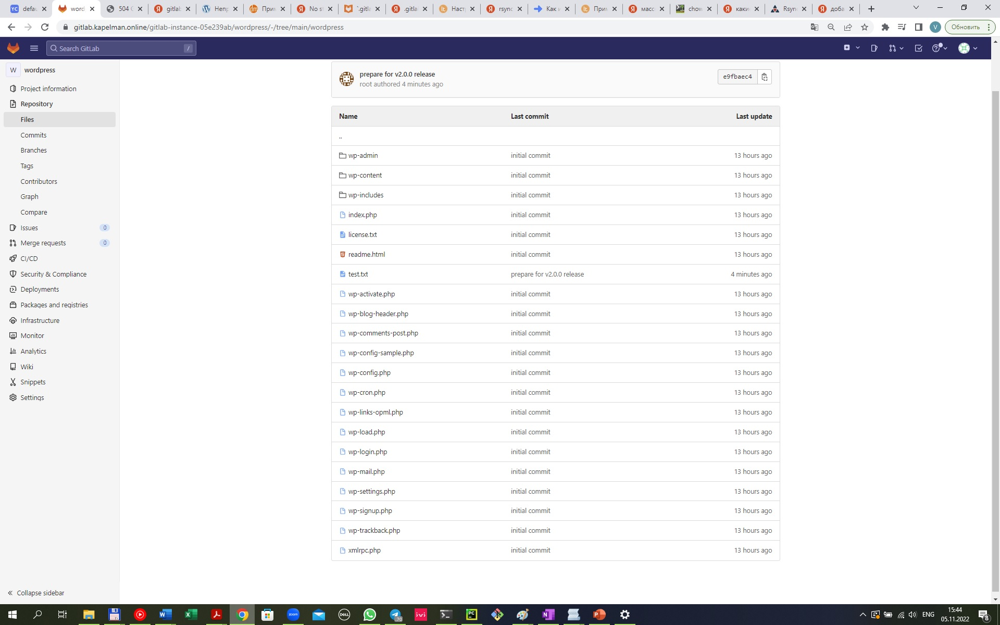
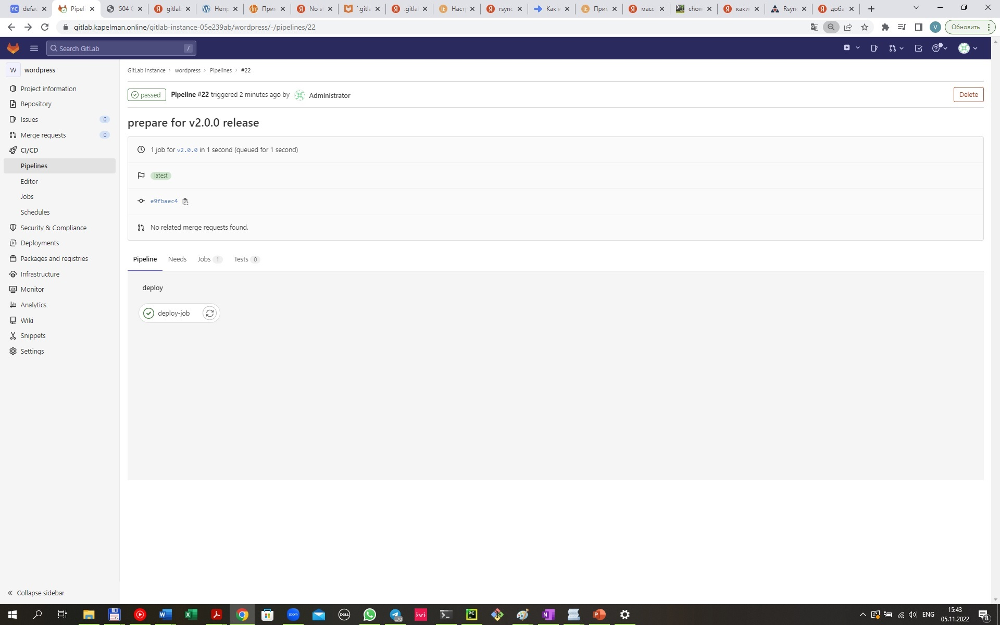
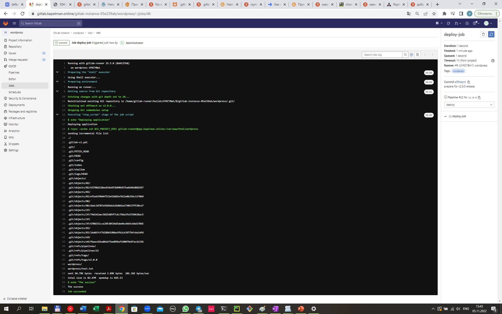
 
 - новый файл на продуктивной среде
```
gitlab-runner@app:/var/www/html/wordpress$ ls -al
total 228
drwxrwxr-x  5 gitlab-runner gitlab-runner  4096 Nov  5 12:41 .
drwxrwxr-x  7 gitlab-runner gitlab-runner  4096 Nov  5 12:41 ..
-rw-rw-r--  1 gitlab-runner gitlab-runner     0 Nov  5 10:16 deploy.test
-rw-rw-r--  1 gitlab-runner gitlab-runner   405 Nov  5 10:16 index.php
-rw-rw-r--  1 gitlab-runner gitlab-runner 19915 Nov  5 10:16 license.txt
-rw-rw-r--  1 gitlab-runner gitlab-runner  7401 Nov  5 10:16 readme.html
-rw-rw-r--  1 gitlab-runner gitlab-runner     0 Nov  5 10:16 test2.kk
-rw-rw-r--  1 gitlab-runner gitlab-runner    19 Nov  5 12:41 test.txt
-rw-rw-r--  1 gitlab-runner gitlab-runner  7165 Nov  5 10:16 wp-activate.php
drwxrwxr-x  9 gitlab-runner gitlab-runner  4096 Nov  5 10:16 wp-admin
-rw-rw-r--  1 gitlab-runner gitlab-runner   351 Nov  5 10:16 wp-blog-header.php
-rw-rw-r--  1 gitlab-runner gitlab-runner  2338 Nov  5 10:16 wp-comments-post.php
-rw-rw-r--  1 gitlab-runner gitlab-runner  2741 Nov  5 10:16 wp-config.php
-rw-rw-r--  1 gitlab-runner gitlab-runner  3001 Nov  5 10:16 wp-config-sample.php
drwxrwxr-x  4 gitlab-runner gitlab-runner  4096 Nov  5 10:16 wp-content
-rw-rw-r--  1 gitlab-runner gitlab-runner  3943 Nov  5 10:16 wp-cron.php
drwxrwxr-x 26 gitlab-runner gitlab-runner 12288 Nov  5 10:16 wp-includes
-rw-rw-r--  1 gitlab-runner gitlab-runner  2494 Nov  5 10:16 wp-links-opml.php
-rw-rw-r--  1 gitlab-runner gitlab-runner  3973 Nov  5 10:16 wp-load.php
-rw-rw-r--  1 gitlab-runner gitlab-runner 48498 Nov  5 10:16 wp-login.php
-rw-rw-r--  1 gitlab-runner gitlab-runner  8522 Nov  5 10:16 wp-mail.php
-rw-rw-r--  1 gitlab-runner gitlab-runner 23706 Nov  5 10:16 wp-settings.php
-rw-rw-r--  1 gitlab-runner gitlab-runner 32051 Nov  5 10:16 wp-signup.php
-rw-rw-r--  1 gitlab-runner gitlab-runner  4817 Nov  5 10:16 wp-trackback.php
-rw-rw-r--  1 gitlab-runner gitlab-runner  3236 Nov  5 10:16 xmlrpc.php
```


6.Установка Prometheus, Alert Manager, Node Exporter и Grafana

Необходимо разработать Ansible роль для установки Prometheus, Alert Manager и Grafana.

Рекомендации:

• Имя сервера: monitoring.you.domain
• Характеристики: 4vCPU, 4 RAM, Internal address.

Цель:

Получение метрик со всей инфраструктуры.
Ожидаемые результаты:

Интерфейсы Prometheus, Alert Manager и Grafana доступены по https.
В вашей доменной зоне настроены A-записи на внешний адрес reverse proxy:
• https://grafana.you.domain (Grafana)
• https://prometheus.you.domain (Prometheus)
• https://alertmanager.you.domain (Alert Manager)
На сервере you.domain отредактированы upstreams для выше указанных URL и они смотрят на виртуальную машину на которой установлены Prometheus, Alert Manager и Grafana.
На всех серверах установлен Node Exporter и его метрики доступны Prometheus.
У Alert Manager есть необходимый набор правил для создания алертов.
В Grafana есть дашборд отображающий метрики из Node Exporter по всем серверам.
В Grafana есть дашборд отображающий метрики из MySQL (*).
В Grafana есть дашборд отображающий метрики из WordPress (*).
Примечание: дашборды со звёздочкой являются опциональными заданиями повышенной сложности их выполнение желательно, но не обязательно.

Решение:

Будем использовать две роли:
- Роль node для установки. Роль node работает для всех хостов, кроме monitoring.kapelman.online
- Роль promgraf для установки grafana, prometheus, alertmanager. Роль promgraf применима только для monitoring.kapelman.online
Роли доступны внутри репозитария.

- End points для upstreams сервера NGINX
grafana http://app.kapelman.online:3000/
prometheus http://app.kapelman.online:9090/graph 
alertmanager http://app.kapelman.online:9093/

- для создания виртуальной машины будем использовать terraform, скрипт для создания node06.tf
- все ПО развоварачивается из архивных файлов (папка files).
- структура роли node следующая:
```
vagrant@vagrant:~/diplom/final/ansible/roles/node$ ls -al
total 24
drwxrwxr-x 6 vagrant vagrant 4096 Nov  3 17:54 .
drwxrwxr-x 8 vagrant vagrant 4096 Nov  2 21:29 ..
drwxrwxr-x 2 vagrant vagrant 4096 Nov  2 22:21 files
drwxrwxr-x 2 vagrant vagrant 4096 Nov  5 07:37 tasks
drwxrwxr-x 2 vagrant vagrant 4096 Nov  3 22:07 templates
drwxrwxr-x 2 vagrant vagrant 4096 Nov  2 21:38 vars
```
- структура ролиp promgraf:
```
vagrant@vagrant:~/diplom/final/ansible/roles/promgraf$ ls -al
total 24
drwxrwxr-x 6 vagrant vagrant 4096 Nov  1 19:46 .
drwxrwxr-x 8 vagrant vagrant 4096 Nov  2 21:29 ..
drwxrwxr-x 2 vagrant vagrant 4096 Nov  1 19:52 files
drwxrwxr-x 2 vagrant vagrant 4096 Nov  4 20:10 tasks
drwxrwxr-x 2 vagrant vagrant 4096 Nov  4 20:16 templates
drwxrwxr-x 2 vagrant vagrant 4096 Nov  2 21:45 vars
```
- скриншоты работающих сервисов:


- выполним требуемые настройки и посмотрим на результат. Сначала настроим дашборд для работы через promotheus
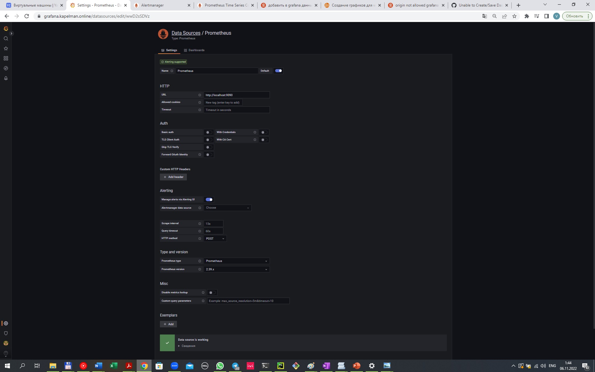

- настроим дашборд на данных prometheus, видно все 4 сервера, которые мы мониторим
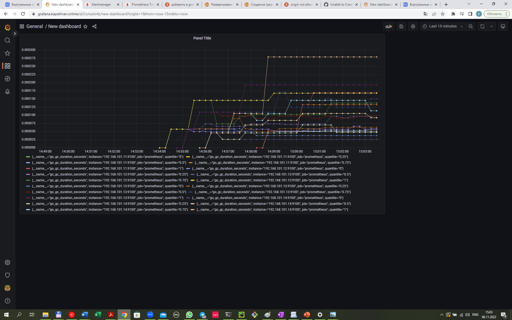

- проверим, что работают службы node_exporter на серверах и что prometheus считывает эти данные. 
Для этого остановим сервер db02 (реплика mysql) и проверим, что происходит в prometheus

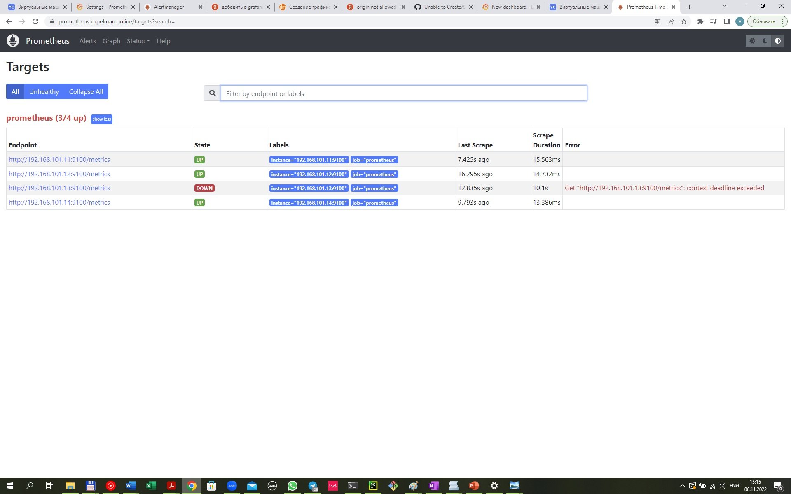

- для prometheus настроено следующее правило:
```
groups:
- name: AllInstances
  rules:
  - alert: InstanceDown
    # Condition for alerting
    expr: up == 0
    for: 1m
    # Annotation - additional informational labels to store more information
    annotations:
      title: 'Instance  down'
      description: '  job has been down for more than 1 minute.'
    # Labels - additional labels to be attached to the alert
    labels:
      severity: 'critical'
```
 - настроена интеграция с alertmanager (/etc/prometheus/prometheus.yml)
```
alerting:
  alertmanagers:
 - static_configs:
   - targets: ['192.168.101.17:9093']
```
- в alertmanager настроена отправка на почту:

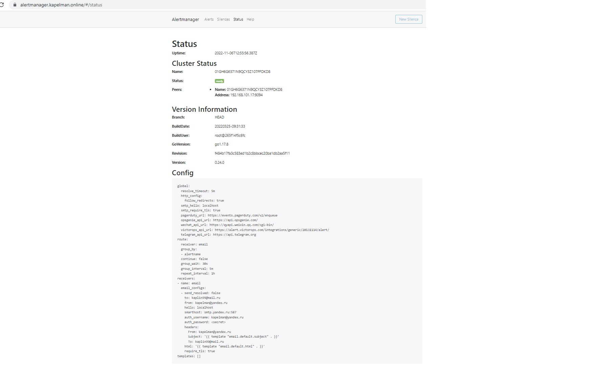

- отключим два хоста и увидим алерты:
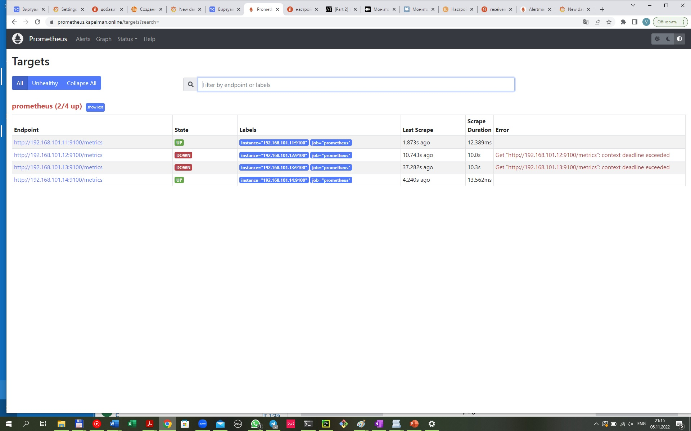


Что необходимо для сдачи задания?

Репозиторий со всеми Terraform манифестами и готовность продемонстрировать создание всех ресурсов с нуля.
Репозиторий со всеми Ansible ролями и готовность продемонстрировать установку всех сервисов с нуля.
Скриншоты веб-интерфейсов всех сервисов работающих по HTTPS на вашем доменном имени.
https://www.you.domain (WordPress)
https://gitlab.you.domain (Gitlab)
https://grafana.you.domain (Grafana)
https://prometheus.you.domain (Prometheus)
https://alertmanager.you.domain (Alert Manager)
Все репозитории рекомендуется хранить на одном из ресурсов (github.com или gitlab.com).


